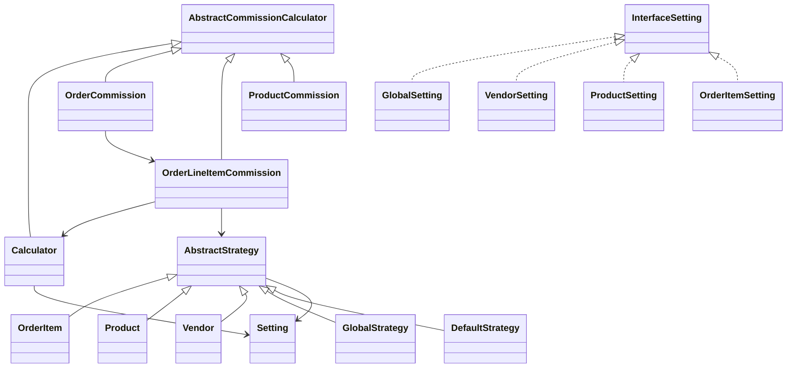
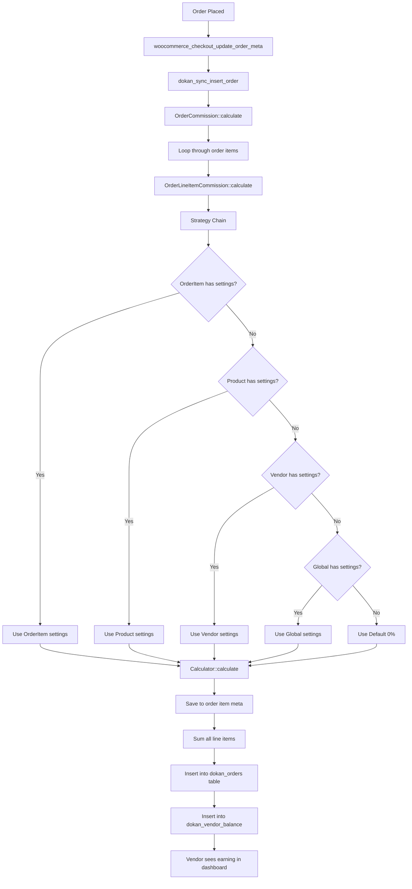

# Dokan Commission System - Complete Developer Documentation

## 1. Overview

Dokan uses a sophisticated commission system to split order earnings between marketplace admin and vendors. The commission is calculated using a **Strategy Pattern** with **Chain of Responsibility** to determine which commission settings to apply based on priority.

### Commission Priority Hierarchy (Highest to Lowest)

1. **Order Item** - Commission saved in order item meta (when order is created)
2. **Product** - Product-specific commission settings
3. **Vendor** - Vendor-specific commission settings (can include category-based)
4. **Global** - Site-wide default commission settings
5. **Default** - Fallback (0% commission)

---

## 2. Architecture

### Core Files Structure

```
dokan-lite/includes/Commission/
├── Calculator.php                    # Main calculation engine
├── AbstractCommissionCalculator.php  # Base calculator class
├── OrderCommission.php               # Order-level commission calculation
├── OrderLineItemCommission.php       # Line item commission calculation
├── ProductCommission.php             # Product commission calculation
├── CouponInfo.php                    # Coupon discount handling
├── RecalculateCommissions.php        # Commission recalculation
├── Model/
│   ├── Commission.php                # Commission data model
│   └── Setting.php                   # Commission settings model
├── Settings/
│   ├── InterfaceSetting.php          # Settings interface
│   ├── GlobalSetting.php             # Global commission settings
│   ├── Vendor.php                    # Vendor commission settings
│   ├── Product.php                   # Product commission settings
│   ├── OrderItem.php                 # Order item commission settings
│   └── DefaultSetting.php            # Default fallback settings
└── Strategies/
    ├── AbstractStrategy.php          # Base strategy class
    ├── OrderItem.php                 # Order item strategy (highest priority)
    ├── Product.php                   # Product strategy
    ├── Vendor.php                    # Vendor strategy
    ├── GlobalStrategy.php            # Global strategy
    └── DefaultStrategy.php           # Default strategy (lowest priority)
```

### Class Diagram



---

## 3. Commission Types

### Supported Types

| Type           | Key              | Description                                                  |
| -------------- | ---------------- | ------------------------------------------------------------ |
| Percentage     | `percentage`     | Admin takes a percentage of product price                    |
| Flat           | `flat`           | Admin takes a fixed amount per item (multiplied by quantity) |
| Combine        | `combine`        | Legacy: Percentage + Flat combined (deprecated in 3.14.0)    |
| Category Based | `category_based` | Different rates per product category                         |
| Fixed          | `fixed`          | Default fallback (0% commission)                             |

---

## 4. Database Schema

### Table: `wp_dokan_orders`

Stores order-level commission data for quick vendor earning retrieval.

```sql
CREATE TABLE `wp_dokan_orders` (
    `id` bigint(20) unsigned NOT NULL AUTO_INCREMENT,
    `order_id` bigint(20) DEFAULT NULL,
    `seller_id` bigint(20) DEFAULT NULL,
    `order_total` decimal(19,4) DEFAULT NULL,
    `net_amount` decimal(19,4) DEFAULT NULL,   -- Vendor earning
    `order_status` varchar(30) DEFAULT NULL,
    PRIMARY KEY (`id`),
    KEY `order_id` (`order_id`),
    KEY `seller_id` (`seller_id`)
);
```

### Table: `wp_dokan_vendor_balance`

Tracks vendor balance transactions for withdrawal eligibility.

```sql
CREATE TABLE `wp_dokan_vendor_balance` (
    `id` bigint(20) unsigned NOT NULL AUTO_INCREMENT,
    `vendor_id` bigint(20) unsigned NOT NULL,
    `trn_id` bigint(20) unsigned NOT NULL,
    `trn_type` varchar(30) NOT NULL,           -- 'dokan_orders', 'dokan_withdraw', etc.
    `perticulars` text NOT NULL,
    `debit` decimal(19,4) NOT NULL,            -- Vendor earning (positive)
    `credit` decimal(19,4) NOT NULL,           -- Withdrawals (negative)
    `status` varchar(30) DEFAULT NULL,
    `trn_date` timestamp NOT NULL,
    `balance_date` timestamp NOT NULL,         -- When balance becomes available
    PRIMARY KEY (`id`)
);
```

### WooCommerce Order Item Meta Keys

| Meta Key                   | Description                                  |
| -------------------------- | -------------------------------------------- |
| `_dokan_commission_rate`   | Commission percentage                        |
| `_dokan_commission_type`   | Commission type                              |
| `_dokan_commission_source` | Source (order_item, product, vendor, global) |
| `_dokan_additional_fee`    | Flat fee amount                              |
| `dokan_commission_meta`    | Additional metadata                          |

### Product Meta Keys

| Meta Key                             | Description                   |
| ------------------------------------ | ----------------------------- |
| `_per_product_admin_commission`      | Product commission percentage |
| `_per_product_admin_commission_type` | Product commission type       |
| `_per_product_admin_additional_fee`  | Product flat fee              |

### Vendor Meta Keys (User Meta)

| Meta Key                      | Description                       |
| ----------------------------- | --------------------------------- |
| `dokan_admin_percentage`      | Vendor commission percentage      |
| `dokan_admin_percentage_type` | Vendor commission type            |
| `dokan_admin_additional_fee`  | Vendor flat fee                   |
| `admin_category_commission`   | Vendor category-based commissions |

### Global Settings (Option: `dokan_selling`)

```php
[
    'commission_type' => 'percentage',           // percentage, flat, category_based
    'admin_percentage' => '10',                  // Percentage value
    'additional_fee' => '0',                     // Flat fee value
    'commission_category_based_values' => [     // Category-based settings
        'all' => ['percentage' => '10', 'flat' => '0'],
        'items' => [
            'category_id' => ['percentage' => '15', 'flat' => '2']
        ]
    ]
]
```

---

## 5. Commission Calculation Flow



### Key Code Flow

**1. Order Hook Registration** (`[includes/Order/Hooks.php](includes/Order/Hooks.php)`):

```php
add_action('woocommerce_checkout_update_order_meta', 'dokan_sync_insert_order', 20);
add_action('woocommerce_store_api_checkout_order_processed', 'dokan_sync_insert_order', 20);
```

**2. Order Sync Function** (`[includes/Order/functions.php](includes/Order/functions.php)`):

```php
function dokan_sync_insert_order($order_id) {
    // Get vendor earning
    $net_amount = dokan()->commission->get_earning_by_order($order);

    // Insert into dokan_orders
    $wpdb->insert($wpdb->prefix . 'dokan_orders', [
        'order_id'     => $order_id,
        'seller_id'    => $seller_id,
        'order_total'  => $order_total,
        'net_amount'   => $net_amount,
        'order_status' => $order_status,
    ]);

    // Update vendor balance
    $vendor_balance->set_debit($net_amount);
    $vendor_balance->set_balance_date($threshold_date);
    $vendor_balance->save();
}
```

**3. Order Commission Calculation** (`[includes/Commission/OrderCommission.php](includes/Commission/OrderCommission.php)`):

```php
public function calculate(): self {
    foreach ($this->order->get_items() as $item_id => $item) {
        $line_item_commission = dokan_get_container()->get(OrderLineItemCommission::class);
        $line_item_commission->set_order($this->order);
        $line_item_commission->set_item($item);
        $commission = $line_item_commission->calculate();

        $admin_net_commission += $commission->get_admin_net_commission();
        $vendor_net_earning += $commission->get_vendor_net_earning();
    }
    return $this;
}
```

**4. Line Item Commission** (`[includes/Commission/OrderLineItemCommission.php](includes/Commission/OrderLineItemCommission.php)`):

```php
public function calculate(): OrderLineItemCommission {
    $item_price = $this->item->get_total();
    $total_quantity = $this->item->get_quantity();

    // Get strategy chain (OrderItem -> Product -> Vendor -> Global -> Default)
    $strategy = new OrderItem($this->item, $this->vendor_id);
    $strategy->save_settings_to_order_item($this->item);
    $settings = $strategy->get_settings();

    // Calculate commission
    $commission_data = dokan_get_container()->get(Calculator::class)
        ->set_settings($settings)
        ->set_total($this->item->get_total())
        ->set_quantity($total_quantity)
        ->calculate();

    return $this;
}
```

**5. Calculator Formula** (`[includes/Commission/Calculator.php](includes/Commission/Calculator.php)`):

```php
public function calculate(): Commission {
    $raw_admin_commission = $this->calculate_raw_admin_commission();
    $net_amount = $this->get_total();
    $admin_commission = min($raw_admin_commission, $net_amount);
    $vendor_earning = $net_amount - $admin_commission;

    return $this->create_commission($admin_commission, $vendor_earning);
}

private function calculate_raw_admin_commission(): float {
    $percentage_commission = ($net_amount * $percentage) / 100;
    $flat_commission = $flat_value * $quantity;
    return $percentage_commission + $flat_commission;
}
```

---

## 6. Strategy Pattern Implementation

Each strategy determines if it has applicable settings and chains to the next if not.

**AbstractStrategy** (`[includes/Commission/Strategies/AbstractStrategy.php](includes/Commission/Strategies/AbstractStrategy.php)`):

```php
abstract class AbstractStrategy {
    protected ?AbstractStrategy $next = null;
    protected ?Setting $settings;

    public function get_eligible_strategy(): ?AbstractStrategy {
        $this->settings->set_source($this->get_source());

        if ($this->settings->is_applicable()) {
            return $this;
        }

        return $this->get_next() ? $this->get_next()->get_eligible_strategy() : null;
    }
}
```

**Chain Setup:**

- `OrderItem` -> `Product` -> `Vendor` -> `Global` -> `Default`

---

## 7. Commission Settings Classes

### GlobalSetting (`[includes/Commission/Settings/GlobalSetting.php](includes/Commission/Settings/GlobalSetting.php)`)

```php
public function get(): Setting {
    $percentage = dokan_get_option('admin_percentage', 'dokan_selling', '');
    $type = dokan_get_option('commission_type', 'dokan_selling', '');
    $flat = dokan_get_option('additional_fee', 'dokan_selling', '');
    $category_commissions = dokan_get_option('commission_category_based_values', 'dokan_selling', []);

    // Handle category-based
    if ($type === 'category_based') {
        $category_commissions = $category_commissions['items'][$this->category_id] ?? [];
        // Use category-specific or all-category fallback
    }

    return (new Setting())->set_type($type)->set_flat($flat)->set_percentage($percentage);
}
```

### VendorSetting (`[includes/Commission/Settings/Vendor.php](includes/Commission/Settings/Vendor.php)`)

```php
public function get(): Setting {
    $percentage = $this->vendor->get_meta('dokan_admin_percentage', true);
    $type = $this->vendor->get_meta('dokan_admin_percentage_type', true);
    $flat = $this->vendor->get_meta('dokan_admin_additional_fee', true);
    $category_commissions = $this->vendor->get_meta('admin_category_commission', true);

    // Handle vendor category-based commission
    if ($type === 'category_based') {
        // Use vendor's category-specific rate
    }

    return (new Setting())->set_type($type)->set_flat($flat)->set_percentage($percentage);
}
```

### ProductSetting (`[includes/Commission/Settings/Product.php](includes/Commission/Settings/Product.php)`)

```php
public function get(): Setting {
    $percentage = $this->product->get_meta('_per_product_admin_commission', true);
    $type = $this->product->get_meta('_per_product_admin_commission_type', true);
    $flat = $this->product->get_meta('_per_product_admin_additional_fee', true);

    return (new Setting())->set_type($type)->set_flat($flat)->set_percentage($percentage);
}
```

---

## 8. Hooks and Filters for Extension

### Commission Calculation Filters

| Filter                                        | Parameters                     | Location                    | Purpose                           |
| --------------------------------------------- | ------------------------------ | --------------------------- | --------------------------------- |
| `dokan_order_line_item_commission_strategies` | `$strategy`                    | OrderLineItemCommission:122 | Modify strategy chain             |
| `dokan_earning_by_order_item_price`           | `$item_total, $item, $order`   | OrderLineItemCommission:117 | Modify item price for calculation |
| `dokan_order_net_amount`                      | `$net_amount, $order`          | functions.php:249           | Modify final vendor earning       |
| `dokan_get_earning_by_product`                | `$earning, $product, $context` | Commission.php:190          | Filter product earning            |
| `dokan_get_earning_by_order`                  | `$earning, $order, $context`   | Commission.php:245          | Filter order earning              |

### Commission Settings Filters

| Filter                                                  | Parameters              | Location             | Purpose                    |
| ------------------------------------------------------- | ----------------------- | -------------------- | -------------------------- |
| `dokan_global_commission_settings_before_save`          | `$setting`              | GlobalSetting.php:80 | Modify before save         |
| `dokan_vendor_commission_settings_before_save`          | `$setting, $vendor`     | Vendor.php:91        | Modify vendor settings     |
| `dokan_product_commission_settings_before_save`         | `$setting, $product`    | Product.php:69       | Modify product settings    |
| `dokan_order_line_item_commission_settings_before_save` | `$setting, $order_item` | OrderItem.php:80     | Modify order item settings |

### Commission Settings Actions

| Action                                                 | Parameters               | Location             | Purpose               |
| ------------------------------------------------------ | ------------------------ | -------------------- | --------------------- |
| `dokan_global_commission_settings_after_save`          | `$setting`               | GlobalSetting.php:90 | After global save     |
| `dokan_vendor_commission_settings_after_save`          | `$setting, $vendor`      | Vendor.php:98        | After vendor save     |
| `dokan_product_commission_settings_after_save`         | `$settings, $product`    | Product.php:82       | After product save    |
| `dokan_order_line_item_commission_settings_after_save` | `$settings, $order_item` | OrderItem.php:97     | After order item save |

### Recalculation Action

| Action                                                         | Parameters  | Location                   |
| -------------------------------------------------------------- | ----------- | -------------------------- |
| `dokan_recalculate_order_commission_and_adjust_vendor_balance` | `$order_id` | RecalculateCommissions.php |

---

## 9. How to Extend Commission Feature

### Example 1: Add Custom Commission Type

```php
// Add custom commission strategy
add_filter('dokan_order_line_item_commission_strategies', function($strategy) {
    // Create custom strategy that checks before product level
    $custom_strategy = new My_Custom_Commission_Strategy($strategy);
    return $custom_strategy;
});

class My_Custom_Commission_Strategy extends AbstractStrategy {
    private AbstractStrategy $original_strategy;

    public function __construct(AbstractStrategy $strategy) {
        $this->original_strategy = $strategy;
        parent::__construct();
    }

    public function get_source(): string {
        return 'my_custom_source';
    }

    public function set_settings() {
        // Get your custom commission settings
        $custom_rate = get_option('my_custom_commission_rate', '');

        $this->settings = new Setting();
        $this->settings->set_type('percentage')
                       ->set_percentage($custom_rate);
    }

    public function set_next(): AbstractStrategy {
        $this->next = $this->original_strategy;
        return $this;
    }
}
```

### Example 2: Modify Commission Based on Product Attribute

```php
add_filter('dokan_earning_by_order_item_price', function($item_total, $item, $order) {
    $product = $item->get_product();

    // Apply different commission for digital products
    if ($product && $product->is_virtual()) {
        // Reduce item total for commission calculation
        $item_total = $item_total * 0.8; // 20% less commission
    }

    return $item_total;
}, 10, 3);
```

### Example 3: Add Time-Based Commission

```php
add_filter('dokan_order_net_amount', function($net_amount, $order) {
    // Give vendors better commission during weekends
    $day = date('N');
    if ($day >= 6) { // Saturday or Sunday
        // Increase vendor earning by 5%
        $net_amount = $net_amount * 1.05;
    }

    return $net_amount;
}, 10, 2);
```

### Example 4: Create Custom Commission Settings UI

```php
// Add meta box for custom commission settings
add_action('add_meta_boxes', function() {
    add_meta_box(
        'my_custom_commission',
        'Custom Commission',
        'render_custom_commission_metabox',
        'product',
        'side'
    );
});

// Save custom commission settings
add_action('dokan_product_commission_settings_after_save', function($settings, $product) {
    if (isset($_POST['my_custom_commission_field'])) {
        $product->update_meta_data('_my_custom_commission',
            sanitize_text_field($_POST['my_custom_commission_field']));
        $product->save();
    }
}, 10, 2);
```

---

## 10. Dokan Pro Extensions

Dokan Pro extends the commission system with:

### Additional Features

1. **Admin Coupon Commission Types**: `from_vendor`, `from_admin`, `shared_coupon`
2. **Subscription Product Commissions**: Per-subscription-product rates
3. **Background Commission Regeneration**: Tool to recalculate all orders
4. **Enhanced Commission Logs**: Detailed breakdowns with gateway fees

### Pro-Specific Hooks

| Hook                             | Purpose                                     |
| -------------------------------- | ------------------------------------------- |
| `dokan_prepare_for_calculation`  | Combine commission calculation (deprecated) |
| `dokan_log_exclude_commission`   | Exclude from commission logs                |
| `dokan_show_commission_meta_box` | Control meta box visibility                 |

---

## 11. Helper Functions

```php
// Get vendor earning by order
$earning = dokan()->commission->get_earning_by_order($order, 'seller');

// Get earning by product
$earning = dokan()->commission->get_earning_by_product($product, 'seller', $price);

// Get commission calculator
$calculator = dokan_get_container()->get(OrderCommission::class);
$calculator->set_order($order)->calculate();
$admin_commission = $calculator->get_admin_commission();
$vendor_earning = $calculator->get_vendor_earning();

// Get vendor balance
$balance = dokan()->vendor->get($vendor_id)->get_balance();

// Check if commission is applicable
$setting = new Setting();
$setting->set_percentage('10')->set_flat('5');
$is_applicable = $setting->is_applicable(); // true if percentage or flat is set
```

---

## 12. Best Practices for Extension

1. **Use filters over direct modifications**: Always use provided hooks
2. **Maintain priority chain**: Don't break the strategy chain
3. **Save to order meta**: Commission settings should be saved to order for history
4. **Handle refunds**: Consider refund calculations when modifying commission
5. **Test with all commission types**: Verify percentage, flat, and category-based work
6. **Consider fee recipients**: Shipping, tax, and gateway fees have separate recipients

---

## 13. Summary

The Dokan commission system is built on:

- **Strategy Pattern**: For flexible priority-based commission resolution
- **Chain of Responsibility**: OrderItem -> Product -> Vendor -> Global -> Default
- **Dependency Injection**: Using Dokan's container for class resolution
- **WooCommerce Integration**: Uses order item meta for persistence
- **Custom Tables**: `dokan_orders` and `dokan_vendor_balance` for quick queries

To extend, use the provided filters and actions. The most common extension points are:

- `dokan_order_line_item_commission_strategies` - Add custom strategy
- `dokan_order_net_amount` - Modify final vendor earning
- `dokan_*_commission_settings_before_save` - Modify settings before save
