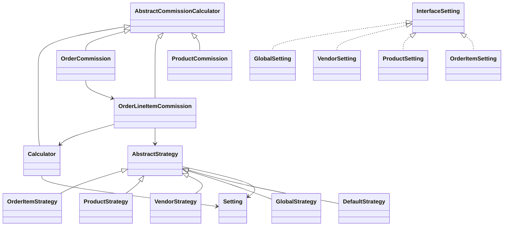
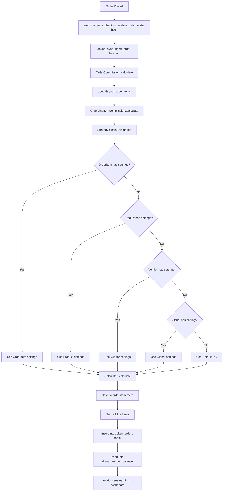

# Dokan Commission System - Complete Developer Documentation

This document provides a comprehensive guide to understanding and extending the Dokan commission system for WordPress plugin developers.

## Table of Contents

1. [Overview](#1-overview)
2. [Architecture](#2-architecture)
3. [Commission Types](#3-commission-types)
4. [Database Schema](#4-database-schema)
5. [Commission Calculation Flow](#5-commission-calculation-flow)
6. [Strategy Pattern Implementation](#6-strategy-pattern-implementation)
7. [Commission Settings Classes](#7-commission-settings-classes)
8. [Hooks and Filters for Extension](#8-hooks-and-filters-for-extension)
9. [How to Extend Commission Feature](#9-how-to-extend-commission-feature)
10. [Dokan Pro Extensions](#10-dokan-pro-extensions)
11. [Helper Functions](#11-helper-functions)
12. [Best Practices for Extension](#12-best-practices-for-extension)
13. [Summary](#13-summary)

---

## 1. Overview

Dokan uses a sophisticated commission system to split order earnings between the marketplace admin and vendors. The commission is calculated using a **Strategy Pattern** with **Chain of Responsibility** to determine which commission settings to apply based on priority.

### How It Works

When an order is placed, Dokan calculates the commission for each line item using a priority-based strategy chain. The first strategy with valid settings wins, and that commission is applied to the order item.

### Commission Priority Hierarchy (Highest to Lowest)

| Priority | Level | Description |
|----------|-------|-------------|
| 1 | **Order Item** | Commission saved in order item meta (when order is created) |
| 2 | **Product** | Product-specific commission settings |
| 3 | **Vendor** | Vendor-specific commission settings (can include category-based) |
| 4 | **Global** | Site-wide default commission settings |
| 5 | **Default** | Fallback (0% commission) |

### Key Concepts

- **Admin Commission**: The amount the marketplace owner takes from each sale
- **Vendor Earning**: The amount the vendor receives after commission deduction
- **Net Amount**: The vendor's actual earning stored in the database

**Formula:**
```
Vendor Earning = Order Item Total - Admin Commission
```

---

## 2. Architecture

### Core Files Structure

The commission system is organized in a clean, object-oriented structure:

```
dokan-lite/includes/Commission/
├── Calculator.php                    # Main calculation engine
├── AbstractCommissionCalculator.php  # Base calculator class
├── OrderCommission.php               # Order-level commission calculation
├── OrderLineItemCommission.php       # Line item commission calculation
├── ProductCommission.php             # Product commission calculation
├── CouponInfo.php                    # Coupon discount handling
├── RecalculateCommissions.php        # Commission recalculation
├── Model/
│   ├── Commission.php                # Commission data model
│   └── Setting.php                   # Commission settings model
├── Settings/
│   ├── InterfaceSetting.php          # Settings interface
│   ├── GlobalSetting.php             # Global commission settings
│   ├── Vendor.php                    # Vendor commission settings
│   ├── Product.php                   # Product commission settings
│   ├── OrderItem.php                 # Order item commission settings
│   └── DefaultSetting.php            # Default fallback settings
├── Strategies/
│   ├── AbstractStrategy.php          # Base strategy class
│   ├── OrderItem.php                 # Order item strategy (highest priority)
│   ├── Product.php                   # Product strategy
│   ├── Vendor.php                    # Vendor strategy
│   ├── GlobalStrategy.php            # Global strategy
│   └── DefaultStrategy.php           # Default strategy (lowest priority)
└── DependencyManagement/
    └── Providers/
        └── CommissionServiceProvider.php  # Dependency injection provider
```

### Class Relationships

```
┌─────────────────────────────────────────────────────────────────────────┐
│                        Commission Calculators                            │
├─────────────────────────────────────────────────────────────────────────┤
│  AbstractCommissionCalculator                                            │
│       ├── Calculator           (performs actual math)                    │
│       ├── OrderCommission      (calculates for entire order)             │
│       ├── OrderLineItemCommission (calculates per line item)             │
│       └── ProductCommission    (calculates for a product)                │
└─────────────────────────────────────────────────────────────────────────┘

┌─────────────────────────────────────────────────────────────────────────┐
│                          Strategy Chain                                  │
├─────────────────────────────────────────────────────────────────────────┤
│  AbstractStrategy                                                        │
│       ├── OrderItem     ──────► Product ──────► Vendor ──────►          │
│       │                                                                  │
│       └──────────────────────► GlobalStrategy ──────► DefaultStrategy   │
└─────────────────────────────────────────────────────────────────────────┘

┌─────────────────────────────────────────────────────────────────────────┐
│                         Settings Classes                                 │
├─────────────────────────────────────────────────────────────────────────┤
│  InterfaceSetting                                                        │
│       ├── GlobalSetting    (reads from dokan_selling option)             │
│       ├── Vendor           (reads from vendor user meta)                 │
│       ├── Product          (reads from product meta)                     │
│       ├── OrderItem        (reads from order item meta)                  │
│       └── DefaultSetting   (returns zero commission)                     │
└─────────────────────────────────────────────────────────────────────────┘
```

### Class Diagram (Mermaid)



---

## 3. Commission Types

### Supported Types

| Type | Key | Description | Example |
|------|-----|-------------|---------|
| **Percentage** | `percentage` | Admin takes a percentage of product price | 10% of $100 = $10 admin, $90 vendor |
| **Flat** | `flat` | Admin takes a fixed amount per item (multiplied by quantity) | $5 flat × 3 qty = $15 admin |
| **Combine** | `combine` | Legacy: Percentage + Flat combined (deprecated in 3.14.0) | 10% + $2 flat |
| **Category Based** | `category_based` | Different rates per product category | Electronics: 15%, Clothing: 10% |
| **Fixed** | `fixed` | Default fallback (0% commission) | Admin gets nothing |

### Commission Type Determination

```php
// In Model/Setting.php
public function is_applicable(): bool {
    // A setting is applicable if either percentage or flat is set
    return trim( $this->percentage ) !== '' || trim( $this->flat ) !== '';
}
```

### Calculation Formula

**For Percentage Type:**
```
Admin Commission = (Item Total × Percentage) / 100
Vendor Earning = Item Total - Admin Commission
```

**For Flat Type:**
```
Admin Commission = Flat Amount × Quantity
Vendor Earning = Item Total - Admin Commission
```

**For Combined Type (Legacy):**
```
Admin Commission = ((Item Total × Percentage) / 100) + (Flat Amount × Quantity)
Vendor Earning = Item Total - Admin Commission
```

---

## 4. Database Schema

### Table: `wp_dokan_orders`

Stores order-level commission data for quick vendor earning retrieval.

```sql
CREATE TABLE IF NOT EXISTS `wp_dokan_orders` (
    `id` bigint(20) unsigned NOT NULL AUTO_INCREMENT,
    `order_id` bigint(20) DEFAULT NULL,
    `seller_id` bigint(20) DEFAULT NULL,
    `order_total` decimal(19,4) DEFAULT NULL,
    `net_amount` decimal(19,4) DEFAULT NULL,   -- Vendor earning after commission
    `order_status` varchar(30) DEFAULT NULL,
    PRIMARY KEY (`id`),
    KEY `order_id` (`order_id`),
    KEY `seller_id` (`seller_id`)
) ENGINE=InnoDB;
```

**Column Descriptions:**
- `order_id`: WooCommerce order ID
- `seller_id`: Vendor's WordPress user ID
- `order_total`: Total order amount before commission
- `net_amount`: Vendor's earning (after admin commission deducted)
- `order_status`: Order status prefixed with 'wc-'

### Table: `wp_dokan_vendor_balance`

Tracks vendor balance transactions for withdrawal eligibility.

```sql
CREATE TABLE IF NOT EXISTS `wp_dokan_vendor_balance` (
    `id` bigint(20) unsigned NOT NULL AUTO_INCREMENT,
    `vendor_id` bigint(20) unsigned NOT NULL,
    `trn_id` bigint(20) unsigned NOT NULL,
    `trn_type` varchar(30) NOT NULL,
    `perticulars` text NOT NULL,
    `debit` decimal(19,4) NOT NULL,
    `credit` decimal(19,4) NOT NULL,
    `status` varchar(30) DEFAULT NULL,
    `trn_date` timestamp NOT NULL,
    `balance_date` timestamp NOT NULL,
    PRIMARY KEY (`id`)
) ENGINE=InnoDB;
```

**Column Descriptions:**
- `vendor_id`: Vendor's WordPress user ID
- `trn_id`: Transaction reference ID (order ID for earnings)
- `trn_type`: Transaction type (`dokan_orders`, `dokan_withdraw`, `dokan_refund`)
- `perticulars`: Description of the transaction
- `debit`: Vendor earning amount (positive values)
- `credit`: Withdrawal amount (negative values)
- `status`: Transaction status
- `trn_date`: When the transaction occurred
- `balance_date`: When the balance becomes available for withdrawal (based on threshold)

### WooCommerce Order Item Meta Keys

These are stored in the `wp_woocommerce_order_itemmeta` table:

| Meta Key | Description | Example Value |
|----------|-------------|---------------|
| `_dokan_commission_rate` | Commission percentage | `10` |
| `_dokan_commission_type` | Commission type | `percentage` |
| `_dokan_commission_source` | Source of commission setting | `product`, `vendor`, `global` |
| `_dokan_additional_fee` | Flat fee amount | `5.00` |
| `dokan_commission_meta` | Additional metadata (JSON) | `{"category_id": 15}` |

### Product Meta Keys

Stored in `wp_postmeta` table:

| Meta Key | Description | Example Value |
|----------|-------------|---------------|
| `_per_product_admin_commission` | Product commission percentage | `15` |
| `_per_product_admin_commission_type` | Product commission type | `percentage` |
| `_per_product_admin_additional_fee` | Product flat fee | `2.50` |

### Vendor Meta Keys (User Meta)

Stored in `wp_usermeta` table:

| Meta Key | Description | Example Value |
|----------|-------------|---------------|
| `dokan_admin_percentage` | Vendor commission percentage | `12` |
| `dokan_admin_percentage_type` | Vendor commission type | `percentage` |
| `dokan_admin_additional_fee` | Vendor flat fee | `1.00` |
| `admin_category_commission` | Vendor category-based commissions | Array (see below) |

**Category Commission Structure:**
```php
[
    'all' => [
        'percentage' => '10',
        'flat' => '0'
    ],
    'items' => [
        '15' => ['percentage' => '12', 'flat' => '1'],  // Category ID 15
        '23' => ['percentage' => '8', 'flat' => '0.5'], // Category ID 23
    ]
]
```

### Global Settings

Stored in `wp_options` table under the key `dokan_selling`:

```php
[
    'commission_type' => 'percentage',           // percentage, flat, category_based
    'admin_percentage' => '10',                  // Percentage value
    'additional_fee' => '0',                     // Flat fee value
    'commission_category_based_values' => [     // Category-based settings
        'all' => [
            'percentage' => '10',
            'flat' => '0'
        ],
        'items' => [
            '15' => ['percentage' => '15', 'flat' => '2'],
            '23' => ['percentage' => '8', 'flat' => '1']
        ]
    ]
]
```

---

## 5. Commission Calculation Flow

### Visual Flow Diagram



### Step-by-Step Breakdown

#### Step 1: Order Hook Registration

Location: `includes/Order/Hooks.php`

```php
// Hooks that trigger commission calculation
add_action( 'woocommerce_checkout_update_order_meta', 'dokan_sync_insert_order', 20 );
add_action( 'woocommerce_store_api_checkout_order_processed', 'dokan_sync_insert_order', 20 );
add_action( 'dokan_checkout_update_order_meta', 'dokan_sync_insert_order' );

// For admin-created orders
if ( is_admin() ) {
    add_action( 'woocommerce_process_shop_order_meta', 'dokan_sync_insert_order', 60 );
}
```

#### Step 2: Order Sync Function

Location: `includes/Order/functions.php`

```php
function dokan_sync_insert_order( $order_id ) {
    global $wpdb;

    // Get the order object
    $order = wc_get_order( $order_id );
    
    // Skip if already synced or is a parent order with sub-orders
    if ( dokan()->order->is_order_already_synced( $order ) ) {
        return;
    }
    
    if ( (int) $order->get_meta( 'has_sub_order', true ) === 1 ) {
        return;
    }

    // Get vendor and calculate earnings
    $seller_id    = dokan_get_seller_id_by_order( $order->get_id() );
    $order_total  = $order->get_total();
    $order_status = 'wc-' . $order->get_status();
    
    // Calculate vendor earning (this triggers commission calculation)
    $net_amount = dokan()->commission->get_earning_by_order( $order );
    $net_amount = apply_filters( 'dokan_order_net_amount', $net_amount, $order );
    
    // Get withdrawal threshold days
    $threshold_day = dokan_get_withdraw_threshold( $seller_id );

    // Delete existing record if any
    dokan()->order->delete_seller_order( $order_id, $seller_id );

    // Insert into dokan_orders table
    $wpdb->insert(
        $wpdb->prefix . 'dokan_orders',
        [
            'order_id'     => $order_id,
            'seller_id'    => $seller_id,
            'order_total'  => $order_total,
            'net_amount'   => $net_amount,
            'order_status' => $order_status,
        ],
        [ '%d', '%d', '%f', '%f', '%s' ]
    );

    // Create vendor balance entry
    $vendor_balance = dokan()->get_container()->get( VendorBalance::class );
    $vendor_balance->set_vendor_id( $seller_id );
    $vendor_balance->set_trn_id( $order_id );
    $vendor_balance->set_trn_type( $vendor_balance::TRN_TYPE_DOKAN_ORDERS );
    $vendor_balance->set_particulars( 'New order' );
    $vendor_balance->set_debit( $net_amount );
    $vendor_balance->set_trn_date( dokan_current_datetime()->format( 'Y-m-d H:i:s' ) );
    $vendor_balance->set_balance_date( 
        dokan_current_datetime()
            ->modify( "+ $threshold_day days" )
            ->format( 'Y-m-d H:i:s' ) 
    );
    $vendor_balance->save();
}
```

#### Step 3: Order Commission Calculation

Location: `includes/Commission/OrderCommission.php`

```php
public function calculate(): self {
    if ( ! $this->order ) {
        throw new \Exception( 'Order is required for order commission calculation.' );
    }

    $this->reset_order_commission_data();

    $admin_net_commission = 0;
    $admin_discount       = 0;
    $vendor_net_earning   = 0;
    $vendor_discount      = 0;

    // Loop through each order item
    foreach ( $this->order->get_items() as $item_id => $item ) {
        try {
            // Get line item commission calculator from container
            $line_item_commission = dokan_get_container()->get( OrderLineItemCommission::class );
            $line_item_commission->set_should_adjust_refund( $this->get_should_adjust_refund() );
            $line_item_commission->set_order( $this->order );
            $line_item_commission->set_item( $item );

            // Calculate commission for this line item
            $commission = $line_item_commission->calculate();

            // Accumulate totals
            $admin_net_commission += $commission->get_admin_net_commission();
            $admin_discount       += $commission->get_admin_discount();
            $vendor_net_earning   += $commission->get_vendor_net_earning();
            $vendor_discount      += $commission->get_vendor_discount();

            // Store for later reference
            $this->commission_by_line_item[ $item_id ] = $commission;
        } catch ( \Exception $exception ) {
            dokan_log( 
                sprintf( 'Error calculating commission for order item %s: %s', 
                    $item_id, 
                    $exception->getMessage() 
                ), 
                'error' 
            );
        }
    }
    
    // Set final totals
    $this->set_admin_net_commission( $admin_net_commission )
        ->set_admin_discount( $admin_discount )
        ->set_vendor_net_earning( $vendor_net_earning )
        ->set_vendor_discount( $vendor_discount );

    $this->is_calculated = true;

    return $this;
}
```

#### Step 4: Line Item Commission Calculation

Location: `includes/Commission/OrderLineItemCommission.php`

```php
public function calculate(): OrderLineItemCommission {
    if ( ! $this->item ) {
        throw new \Exception( 'Order item is required for order item commission calculation.' );
    }

    if ( ! $this->order ) {
        throw new \Exception( 'Order is required for order item commission calculation.' );
    }

    // Get item price (can be filtered)
    $item_price = apply_filters( 
        'dokan_earning_by_order_item_price', 
        $this->item->get_total(), 
        $this->item, 
        $this->order 
    );

    $total_quantity = $this->item->get_quantity();

    // Create strategy chain and find applicable settings
    $strategy = apply_filters(
        'dokan_order_line_item_commission_strategies',
        new OrderItem( $this->item, $this->vendor_id )
    );

    // Save the applicable settings to order item meta
    $strategy->save_settings_to_order_item( $this->item );

    // Get the settings from first applicable strategy
    $settings = $strategy->get_settings();

    // Perform the actual calculation
    $commission_data = dokan_get_container()->get( Calculator::class )
        ->set_settings( $settings )
        ->set_subtotal( $item_price )
        ->set_total( $this->item->get_total() )
        ->set_quantity( $total_quantity )
        ->set_discount( new CouponInfo( $this->get_coupon_infos() ) )
        ->calculate();

    // Adjust for any refunds
    $commission_data = $this->adjust_refunds( $commission_data );

    $this->set_commission_data( $commission_data );

    return $this;
}
```

#### Step 5: Calculator Formula

Location: `includes/Commission/Calculator.php`

```php
public function calculate(): Commission {
    // Calculate raw admin commission
    $raw_admin_commission = $this->calculate_raw_admin_commission();

    $net_amount = $this->get_total();
    
    // Admin commission cannot exceed the total amount
    $admin_commission = min( $raw_admin_commission, $net_amount );

    // Vendor gets the remainder
    $vendor_earning = $net_amount - $admin_commission;

    return $this->create_commission( $admin_commission, $vendor_earning );
}

private function calculate_raw_admin_commission(): float {
    $admin_discount = $this->get_discount()->get_admin_discount();
    
    // Add back admin discount for calculation base
    $net_amount_with_admin_discount = $this->get_total() + $admin_discount;

    // Calculate percentage portion
    $percentage_commission = ( $net_amount_with_admin_discount * $this->settings->get_percentage_value() ) / 100;
    
    // Calculate flat fee portion (multiplied by quantity)
    $flat_commission = $this->settings->get_flat_value() * $this->quantity;
    
    // Handle legacy combine type
    $combine_flat = $this->settings->get_combine_flat();

    // Total raw commission minus admin discount
    return $percentage_commission + $flat_commission + $combine_flat - $admin_discount;
}

private function create_commission( float $admin_commission, float $vendor_earning ): Commission {
    $commission = new Commission();
    $commission->set_admin_net_commission( $admin_commission );
    $commission->set_vendor_discount( $this->get_discount()->get_vendor_discount() );
    $commission->set_vendor_net_earning( $vendor_earning );
    $commission->set_admin_discount( $this->get_discount()->get_admin_discount() );
    $commission->set_settings( $this->settings );

    return $commission;
}
```

---

## 6. Strategy Pattern Implementation

The commission system uses a Strategy Pattern with Chain of Responsibility to determine which commission settings to apply.

### AbstractStrategy Base Class

Location: `includes/Commission/Strategies/AbstractStrategy.php`

```php
abstract class AbstractStrategy {
    protected ?AbstractStrategy $next = null;
    protected ?Setting $settings;

    public function __construct() {
        $this->set_settings();
    }

    // Each strategy must identify its source
    abstract public function get_source(): string;

    // Each strategy must load its own settings
    abstract public function set_settings();

    // Each strategy must define the next in chain
    abstract public function set_next(): AbstractStrategy;

    /**
     * Finds the first strategy with applicable settings.
     */
    public function get_eligible_strategy(): ?AbstractStrategy {
        $this->settings->set_source( $this->get_source() );

        // If this strategy has valid settings, use it
        if ( $this->settings->is_applicable() ) {
            return $this;
        }

        // Otherwise, try the next strategy in chain
        return $this->get_next() ? $this->get_next()->get_eligible_strategy() : null;
    }

    /**
     * Gets the commission settings from the first applicable strategy.
     */
    public function get_settings(): ?Setting {
        return $this->get_eligible_strategy() 
            ? $this->get_eligible_strategy()->settings 
            : null;
    }

    /**
     * Saves the applicable settings to order item for future reference.
     */
    public function save_settings_to_order_item( WC_Order_Item $order_item ): void {
        $settings = $this->get_settings();

        if ( ! $settings || ! $this instanceof OrderItemStrategy ) {
            return;
        }

        $this->get_order_item_setting_saver( $order_item )->save( $settings->to_array() );
    }
}
```

### Strategy Chain Connections

Each strategy connects to the next in the chain:

**OrderItem Strategy** → connects to → **Product Strategy**
```php
// In Strategies/OrderItem.php
public function set_next(): AbstractStrategy {
    $this->next = new Product( 
        $this->order_item->get_product_id(), 
        $this->vendor_id 
    );
    return $this;
}
```

**Product Strategy** → connects to → **Vendor Strategy**
```php
// In Strategies/Product.php
public function set_next(): AbstractStrategy {
    $this->next = new Vendor( 
        $this->vendor_id, 
        $this->get_category_from_product( $this->product_id ) 
    );
    return $this;
}
```

**Vendor Strategy** → connects to → **Global Strategy**
```php
// In Strategies/Vendor.php
public function set_next(): AbstractStrategy {
    $this->next = new GlobalStrategy( $this->category_id );
    return $this;
}
```

**Global Strategy** → connects to → **Default Strategy**
```php
// In Strategies/GlobalStrategy.php
public function set_next(): AbstractStrategy {
    $this->next = new DefaultStrategy();
    return $this;
}
```

### Setting Applicability Check

Location: `includes/Commission/Model/Setting.php`

```php
public function is_applicable(): bool {
    // A setting is considered applicable if either percentage or flat fee is set
    return trim( $this->percentage ) !== '' || trim( $this->flat ) !== '';
}
```

---

## 7. Commission Settings Classes

Each settings class implements `InterfaceSetting` and provides `get()` and `save()` methods.

### GlobalSetting

Location: `includes/Commission/Settings/GlobalSetting.php`

```php
class GlobalSetting implements InterfaceSetting {
    protected int $category_id;

    public function __construct( int $category_id ) {
        $this->category_id = $category_id;
    }

    public function get(): Setting {
        // Read from dokan_selling option
        $percentage           = dokan_get_option( 'admin_percentage', 'dokan_selling', '' );
        $type                 = dokan_get_option( 'commission_type', 'dokan_selling', '' );
        $flat                 = dokan_get_option( 'additional_fee', 'dokan_selling', '' );
        $category_commissions = dokan_get_option( 'commission_category_based_values', 'dokan_selling', [] );

        // Handle category-based commission
        if ( $type === 'category_based' ) {
            $all_category_commissions = $category_commissions['all'] ?? [];
            $specific_category = $category_commissions['items'][ $this->category_id ] ?? [];

            if ( ! empty( $specific_category ) ) {
                $percentage = $specific_category['percentage'] ?? '';
                $flat       = $specific_category['flat'] ?? '';
            } else {
                $percentage = $all_category_commissions['percentage'] ?? '';
                $flat       = $all_category_commissions['flat'] ?? '';
            }
        }

        $settings = new Setting();
        $settings->set_type( $type )
                ->set_flat( $flat )
                ->set_percentage( $percentage );

        return $settings;
    }

    public function save( array $setting ): void {
        $setting = apply_filters( 'dokan_global_commission_settings_before_save', $setting );

        $options = get_option( 'dokan_selling', [] );
        $options['commission_type']                  = $setting['type'] ?? '';
        $options['admin_percentage']                 = $setting['percentage'] ?? '';
        $options['additional_fee']                   = $setting['flat'] ?? '';
        $options['commission_category_based_values'] = $setting['category_commissions'] ?? [];

        update_option( 'dokan_selling', $options );

        do_action( 'dokan_global_commission_settings_after_save', $setting );
    }
}
```

### Vendor Setting

Location: `includes/Commission/Settings/Vendor.php`

```php
class Vendor implements InterfaceSetting {
    protected int $category_id;
    protected $vendor;

    public function __construct( $vendor_id, int $category_id = 0 ) {
        $this->category_id = $category_id;
        $this->vendor = dokan()->vendor->get( $vendor_id );
    }

    public function get(): Setting {
        $percentage = '';
        $type       = '';
        $flat       = '';
        $category_commissions = [];

        if ( 0 !== $this->vendor->get_id() ) {
            $percentage = $this->vendor->get_meta( 'dokan_admin_percentage', true );
            $type       = $this->vendor->get_meta( 'dokan_admin_percentage_type', true );
            $flat       = $this->vendor->get_meta( 'dokan_admin_additional_fee', true );
            $category_commissions = $this->vendor->get_meta( 'admin_category_commission', true );

            $category_commissions = ! is_array( $category_commissions ) ? [] : $category_commissions;
        }

        // Handle vendor-specific category-based commission
        if ( $type === 'category_based' ) {
            $all_category_commissions = $category_commissions['all'] ?? [];
            $specific_category = $category_commissions['items'][ $this->category_id ] ?? [];

            if ( ! empty( $specific_category ) ) {
                $percentage = $specific_category['percentage'] ?? '';
                $flat       = $specific_category['flat'] ?? '';
            } else {
                $percentage = $all_category_commissions['percentage'] ?? '';
                $flat       = $all_category_commissions['flat'] ?? '';
            }
        }

        $settings = new Setting();
        $settings->set_type( $type )
                ->set_flat( $flat )
                ->set_percentage( $percentage )
                ->set_category_commissions( $category_commissions );

        return $settings;
    }

    public function save( array $setting ): Setting {
        if ( ! $this->vendor->get_id() ) {
            return $this->get();
        }

        $setting = apply_filters( 'dokan_vendor_commission_settings_before_save', $setting, $this->vendor );

        $this->vendor->update_meta( 'dokan_admin_percentage', $setting['percentage'] ?? '' );
        $this->vendor->update_meta( 'dokan_admin_percentage_type', $setting['type'] ?? '' );
        $this->vendor->update_meta( 'dokan_admin_additional_fee', $setting['flat'] ?? '' );
        $this->vendor->update_meta( 'admin_category_commission', $setting['category_commissions'] ?? [] );

        do_action( 'dokan_vendor_commission_settings_after_save', $setting, $this->vendor );

        return $this->get();
    }
}
```

### Product Setting

Location: `includes/Commission/Settings/Product.php`

```php
class Product implements InterfaceSetting {
    protected $product;

    public function __construct( $product_id ) {
        $this->product = wc_get_product( $product_id );

        // For variations, use parent product's commission
        if ( $this->product && $this->product->is_type( 'variation' ) ) {
            $this->product = wc_get_product( $this->product->get_parent_id() );
        }
    }

    public function get(): Setting {
        $percentage = '';
        $type       = '';
        $flat       = '';

        if ( is_a( $this->product, WC_Product::class ) && $this->product->get_id() ) {
            $percentage = $this->product->get_meta( '_per_product_admin_commission', true );
            $type       = $this->product->get_meta( '_per_product_admin_commission_type', true );
            $flat       = $this->product->get_meta( '_per_product_admin_additional_fee', true );
        }

        $settings = new Setting();
        $settings->set_type( $type )
                ->set_flat( $flat )
                ->set_percentage( $percentage );

        return $settings;
    }

    public function save( array $setting ): Setting {
        $settings = apply_filters( 'dokan_product_commission_settings_before_save', $setting, $this->product );

        $commission_percentage = $setting['percentage'] ?? '';
        $commission_type       = $setting['type'] ?? '';
        $additional_flat       = $setting['flat'] ?? '';

        if ( is_a( $this->product, WC_Product::class ) && $this->product->get_id() ) {
            $this->product->update_meta_data( '_per_product_admin_commission', $commission_percentage );
            $this->product->update_meta_data( '_per_product_admin_commission_type', $commission_type );
            $this->product->update_meta_data( '_per_product_admin_additional_fee', $additional_flat );
            $this->product->save_meta_data();
            $this->product->save();

            do_action( 'dokan_product_commission_settings_after_save', $settings, $this->product );
        }

        $commission = new Setting();
        $commission->set_type( $commission_type )
                ->set_flat( $additional_flat )
                ->set_percentage( $commission_percentage );

        return $commission;
    }
}
```

---

## 8. Hooks and Filters for Extension

### Commission Calculation Filters

| Filter | Parameters | Location | Purpose |
|--------|------------|----------|---------|
| `dokan_order_line_item_commission_strategies` | `$strategy` | OrderLineItemCommission.php:122 | Modify or replace strategy chain |
| `dokan_earning_by_order_item_price` | `$item_total, $item, $order` | OrderLineItemCommission.php:117 | Modify item price before calculation |
| `dokan_order_net_amount` | `$net_amount, $order` | functions.php:249 | Modify final vendor earning |
| `dokan_get_earning_by_product` | `$earning, $product, $context` | Commission.php:190 | Filter product earning |
| `dokan_get_earning_by_order` | `$earning, $order, $context` | Commission.php:245 | Filter order earning |
| `dokan_commission_multiply_by_order_quantity` | `$quantity` | Formula/Flat.php:92 | Modify quantity multiplier for flat fee |
| `dokan_order_commission_order_fee_recipient` | `$recipient, $order, $this` | OrderCommission.php:592 | Change order fee recipient |

### Commission Settings Filters

| Filter | Parameters | Location | Purpose |
|--------|------------|----------|---------|
| `dokan_global_commission_settings_before_save` | `$setting` | GlobalSetting.php:80 | Modify global settings before save |
| `dokan_vendor_commission_settings_before_save` | `$setting, $vendor` | Vendor.php:91 | Modify vendor settings before save |
| `dokan_product_commission_settings_before_save` | `$setting, $product` | Product.php:69 | Modify product settings before save |
| `dokan_order_line_item_commission_settings_before_save` | `$setting, $order_item` | OrderItem.php:80 | Modify order item settings before save |

### Commission Settings Actions

| Action | Parameters | Location | Purpose |
|--------|------------|----------|---------|
| `dokan_global_commission_settings_after_save` | `$setting` | GlobalSetting.php:90 | After global commission saved |
| `dokan_vendor_commission_settings_after_save` | `$setting, $vendor` | Vendor.php:98 | After vendor commission saved |
| `dokan_product_commission_settings_after_save` | `$settings, $product` | Product.php:82 | After product commission saved |
| `dokan_order_line_item_commission_settings_after_save` | `$settings, $order_item` | OrderItem.php:97 | After order item commission saved |

### Recalculation Actions

| Action | Parameters | Location | Purpose |
|--------|------------|----------|---------|
| `dokan_recalculate_order_commission_and_adjust_vendor_balance` | `$order_id` | RecalculateCommissions.php | Trigger commission recalculation |

### Tax and Refund Actions

| Action | Parameters | Location | Purpose |
|--------|------------|----------|---------|
| `dokan_order_commission_tax_refunded_before` | `$order, $this` | OrderCommission.php:531 | Before tax refund calculation |
| `dokan_order_commission_tax_refunded_after` | `$order, $this` | OrderCommission.php:534 | After tax refund calculation |

---

## 9. How to Extend Commission Feature

### Example 1: Add Custom Commission Strategy

Insert a custom strategy into the chain that checks before the product level:

```php
<?php
use WeDevs\Dokan\Commission\Model\Setting;
use WeDevs\Dokan\Commission\Strategies\AbstractStrategy;

/**
 * Custom commission strategy based on membership level.
 */
class Membership_Commission_Strategy extends AbstractStrategy {
    
    private AbstractStrategy $original_strategy;
    private int $vendor_id;
    
    public function __construct( AbstractStrategy $strategy, int $vendor_id ) {
        $this->original_strategy = $strategy;
        $this->vendor_id = $vendor_id;
        parent::__construct();
    }
    
    public function get_source(): string {
        return 'membership';
    }
    
    public function set_settings() {
        $this->settings = new Setting();
        
        // Get vendor's membership level
        $membership_level = get_user_meta( $this->vendor_id, 'membership_level', true );
        
        // Apply commission based on membership
        switch ( $membership_level ) {
            case 'gold':
                $this->settings->set_type( 'percentage' )->set_percentage( '5' );
                break;
            case 'silver':
                $this->settings->set_type( 'percentage' )->set_percentage( '10' );
                break;
            case 'bronze':
                $this->settings->set_type( 'percentage' )->set_percentage( '15' );
                break;
            default:
                // No membership - don't apply, let chain continue
                $this->settings->set_type( '' )->set_percentage( '' );
        }
    }
    
    public function set_next(): AbstractStrategy {
        // Continue to original strategy chain
        $this->next = $this->original_strategy;
        return $this;
    }
}

// Hook into the strategy chain
add_filter( 'dokan_order_line_item_commission_strategies', function( $strategy ) {
    // Get vendor ID from the order
    $vendor_id = 0;
    if ( method_exists( $strategy, 'get_vendor_id' ) ) {
        $vendor_id = $strategy->get_vendor_id();
    }
    
    // Insert our custom strategy before the existing chain
    return new Membership_Commission_Strategy( $strategy, $vendor_id );
} );
```

### Example 2: Modify Commission Based on Product Attribute

Apply different commission rates for digital vs physical products:

```php
<?php
/**
 * Reduce commission calculation base for digital products.
 */
add_filter( 'dokan_earning_by_order_item_price', function( $item_total, $item, $order ) {
    $product = $item->get_product();
    
    if ( ! $product ) {
        return $item_total;
    }
    
    // Digital products get 20% lower commission base
    if ( $product->is_virtual() || $product->is_downloadable() ) {
        $item_total = $item_total * 0.8;
    }
    
    return $item_total;
}, 10, 3 );
```

### Example 3: Add Time-Based Commission

Give vendors better rates during promotional periods:

```php
<?php
/**
 * Increase vendor earnings during weekend sales.
 */
add_filter( 'dokan_order_net_amount', function( $net_amount, $order ) {
    $day_of_week = (int) date( 'N' );
    
    // Saturday (6) or Sunday (7)
    if ( $day_of_week >= 6 ) {
        // Increase vendor earning by 5%
        $net_amount = $net_amount * 1.05;
    }
    
    // Holiday bonus (example: Christmas week)
    $today = date( 'Y-m-d' );
    if ( $today >= date( 'Y' ) . '-12-20' && $today <= date( 'Y' ) . '-12-26' ) {
        $net_amount = $net_amount * 1.10; // 10% bonus
    }
    
    return $net_amount;
}, 10, 2 );
```

### Example 4: Create Custom Commission Settings UI

Add a custom commission field to products:

```php
<?php
/**
 * Add custom commission meta box to product edit page.
 */
add_action( 'add_meta_boxes', function() {
    add_meta_box(
        'my_custom_commission',
        __( 'Custom Commission Settings', 'my-plugin' ),
        'render_custom_commission_metabox',
        'product',
        'side',
        'default'
    );
} );

function render_custom_commission_metabox( $post ) {
    $product = wc_get_product( $post->ID );
    $custom_rate = $product ? $product->get_meta( '_my_custom_commission_rate', true ) : '';
    
    wp_nonce_field( 'my_custom_commission_nonce', 'my_commission_nonce' );
    ?>
    <p>
        <label for="my_custom_commission_rate">
            <?php esc_html_e( 'Special Commission Rate (%)', 'my-plugin' ); ?>
        </label>
        <input 
            type="number" 
            id="my_custom_commission_rate" 
            name="my_custom_commission_rate" 
            value="<?php echo esc_attr( $custom_rate ); ?>" 
            step="0.01" 
            min="0" 
            max="100"
            class="widefat"
        />
    </p>
    <p class="description">
        <?php esc_html_e( 'Leave empty to use default commission.', 'my-plugin' ); ?>
    </p>
    <?php
}

/**
 * Save custom commission when product is saved.
 */
add_action( 'dokan_product_commission_settings_after_save', function( $settings, $product ) {
    if ( ! isset( $_POST['my_commission_nonce'] ) ) {
        return;
    }
    
    if ( ! wp_verify_nonce( $_POST['my_commission_nonce'], 'my_custom_commission_nonce' ) ) {
        return;
    }
    
    if ( isset( $_POST['my_custom_commission_rate'] ) ) {
        $rate = sanitize_text_field( $_POST['my_custom_commission_rate'] );
        $product->update_meta_data( '_my_custom_commission_rate', $rate );
        $product->save();
    }
}, 10, 2 );
```

### Example 5: Volume-Based Commission

Apply different rates based on order total:

```php
<?php
/**
 * Apply volume-based commission discounts.
 */
add_filter( 'dokan_order_net_amount', function( $net_amount, $order ) {
    $order_total = $order->get_total();
    
    // Volume discount tiers
    if ( $order_total >= 1000 ) {
        // Orders over $1000: vendor gets 5% bonus
        $net_amount = $net_amount * 1.05;
    } elseif ( $order_total >= 500 ) {
        // Orders $500-$999: vendor gets 3% bonus
        $net_amount = $net_amount * 1.03;
    } elseif ( $order_total >= 100 ) {
        // Orders $100-$499: vendor gets 1% bonus
        $net_amount = $net_amount * 1.01;
    }
    
    return $net_amount;
}, 10, 2 );
```

---

## 10. Dokan Pro Extensions

Dokan Pro extends the commission system with additional features.

### Additional Features in Pro

1. **Admin Coupon Commission Types**
   - `from_vendor`: Full coupon discount deducted from vendor
   - `from_admin`: Full coupon discount deducted from admin
   - `shared_coupon`: Split between admin and vendor

2. **Subscription Product Commissions**
   - Per-subscription-product commission rates
   - Stored in product meta with `_subscription_product_admin_*` keys

3. **Background Commission Regeneration**
   - Tool to recalculate commissions for existing orders
   - Accessible via Admin Tools page
   - Uses WP Background Processing

4. **Enhanced Commission Logs**
   - Detailed commission breakdowns
   - Gateway fee tracking
   - Shipping/tax recipient tracking

### Pro-Specific Hooks

| Hook | Purpose | File |
|------|---------|------|
| `dokan_prepare_for_calculation` | Combine commission calculation (deprecated in 3.14.0) | Hooks.php |
| `dokan_log_exclude_commission` | Exclude items from commission logs | product-adv/Hooks.php |
| `dokan_show_commission_meta_box` | Control commission meta box visibility | product-adv/Admin.php |
| `dokan_product_pack_commission_data` | Add fields to subscription commission panel | subscription/admin.php |

### Pro Module Commission Support

Different product types may have their own commission handling:

- **Booking Products**: Per-product commission via `woocommerce_process_product_meta_booking`
- **Auction Products**: Per-product commission via `woocommerce_process_product_meta`
- **Subscription Products**: Specialized commission handling for recurring payments

---

## 11. Helper Functions

### Get Vendor Earning by Order

```php
// Get vendor earning for an order
$earning = dokan()->commission->get_earning_by_order( $order, 'seller' );

// Get admin commission for an order
$admin_commission = dokan()->commission->get_earning_by_order( $order, 'admin' );
```

### Get Earning by Product

```php
// Get vendor earning for a product at a specific price
$earning = dokan()->commission->get_earning_by_product( $product, 'seller', $price );

// Get admin commission for a product
$admin_commission = dokan()->commission->get_earning_by_product( $product, 'admin', $price );
```

### Use Order Commission Calculator

```php
use WeDevs\Dokan\Commission\OrderCommission;

// Get calculator from container
$calculator = dokan_get_container()->get( OrderCommission::class );

// Set the order and calculate
$calculator->set_order( $order )->calculate();

// Get results
$admin_commission = $calculator->get_admin_commission();
$vendor_earning = $calculator->get_vendor_earning();
$vendor_subtotal = $calculator->get_vendor_earning_subtotal(); // Without subsidy

// Get detailed breakdown
$data = $calculator->get_data();
// Returns: [
//     'admin_commission'     => float,
//     'admin_net_commission' => float,
//     'admin_discount'       => float,
//     'admin_subsidy'        => float,
//     'vendor_discount'      => float,
//     'vendor_earning'       => float,
//     'vendor_net_earning'   => float,
// ]
```

### Get Vendor Balance

```php
// Get vendor's available balance
$vendor = dokan()->vendor->get( $vendor_id );
$balance = $vendor->get_balance();
```

### Check If Setting Is Applicable

```php
use WeDevs\Dokan\Commission\Model\Setting;

$setting = new Setting();
$setting->set_percentage( '10' )->set_flat( '5' );

// Returns true if percentage or flat is set
$is_applicable = $setting->is_applicable(); // true
```

### Get Commission Settings

```php
use WeDevs\Dokan\Commission\Settings\GlobalSetting;
use WeDevs\Dokan\Commission\Settings\Vendor;
use WeDevs\Dokan\Commission\Settings\Product;

// Get global settings (with category context)
$global_setting = new GlobalSetting( $category_id );
$settings = $global_setting->get();

// Get vendor settings
$vendor_setting = new Vendor( $vendor_id, $category_id );
$settings = $vendor_setting->get();

// Get product settings
$product_setting = new Product( $product_id );
$settings = $product_setting->get();

// Access setting values
$type = $settings->get_type();
$percentage = $settings->get_percentage_value();
$flat = $settings->get_flat_value();
```

### Save Commission Settings

```php
use WeDevs\Dokan\Commission\Settings\Product;

$product_setting = new Product( $product_id );
$product_setting->save( [
    'type'       => 'percentage',
    'percentage' => '15',
    'flat'       => '',
] );
```

---

## 12. Best Practices for Extension

### 1. Use Filters Over Direct Modifications

Always use the provided hooks rather than modifying core files:

```php
// Good: Using filter
add_filter( 'dokan_order_net_amount', 'my_custom_commission', 10, 2 );

// Bad: Modifying core files directly
// Never do this!
```

### 2. Maintain the Priority Chain

Don't break the strategy chain when adding custom strategies:

```php
// Good: Continue the chain
public function set_next(): AbstractStrategy {
    $this->next = $this->original_strategy;
    return $this;
}

// Bad: Breaking the chain
public function set_next(): AbstractStrategy {
    $this->next = null; // Chain stops here!
    return $this;
}
```

### 3. Save to Order Meta for History

Always save commission settings to order item meta for historical accuracy:

```php
// Good: Save settings to order
$strategy->save_settings_to_order_item( $order_item );

// The system does this automatically, but if you're creating custom logic,
// make sure to persist the commission data
```

### 4. Handle Refunds Properly

Consider refund calculations when modifying commission:

```php
add_filter( 'dokan_order_net_amount', function( $net_amount, $order ) {
    // Check if there are refunds
    $refunded = $order->get_total_refunded();
    
    if ( $refunded > 0 ) {
        // Adjust your custom logic accordingly
    }
    
    return $net_amount;
}, 10, 2 );
```

### 5. Test with All Commission Types

Verify your extensions work with:
- Percentage commission
- Flat fee commission
- Category-based commission
- Combined commission (legacy)

### 6. Consider Fee Recipients

Remember that shipping, tax, and gateway fees have separate recipients:

```php
// These can be 'admin' or 'seller'
$shipping_recipient = dokan()->fees->get_shipping_fee_recipient( $order );
$tax_recipient = dokan()->fees->get_tax_fee_recipient( $order_id );
$shipping_tax_recipient = dokan()->fees->get_shipping_tax_fee_recipient( $order );
```

### 7. Use Dependency Injection

Use the Dokan container to get class instances:

```php
// Good: Using container
$calculator = dokan_get_container()->get( OrderCommission::class );

// Also acceptable: Direct instantiation for simple classes
$setting = new Setting();
```

### 8. Log Errors Appropriately

Use Dokan's logging for commission-related errors:

```php
dokan_log( 
    sprintf( 'Commission calculation error: %s', $exception->getMessage() ), 
    'error' 
);
```

---

## 13. Summary

The Dokan commission system is built on solid design patterns:

- **Strategy Pattern**: For flexible, priority-based commission resolution
- **Chain of Responsibility**: OrderItem → Product → Vendor → Global → Default
- **Dependency Injection**: Using Dokan's container for class resolution
- **WooCommerce Integration**: Uses order item meta for persistence
- **Custom Tables**: `dokan_orders` and `dokan_vendor_balance` for efficient queries

### Key Extension Points

| Extension Point | Best For |
|-----------------|----------|
| `dokan_order_line_item_commission_strategies` | Adding custom strategy to the chain |
| `dokan_earning_by_order_item_price` | Modifying the calculation base |
| `dokan_order_net_amount` | Final vendor earning adjustments |
| `dokan_*_commission_settings_before_save` | Modifying settings before save |
| `dokan_*_commission_settings_after_save` | Performing actions after settings save |

### Quick Reference

```php
// Get vendor earning
$earning = dokan()->commission->get_earning_by_order( $order, 'seller' );

// Get commission calculator
$calc = dokan_get_container()->get( OrderCommission::class );
$calc->set_order( $order )->calculate();

// Save product commission
$product_setting = new Product( $product_id );
$product_setting->save( ['type' => 'percentage', 'percentage' => '10', 'flat' => ''] );
```

---

## Further Reading

- [Dokan Hooks and Filters Documentation](filters-hooks/README.md)
- [Dokan Container Documentation](container.md)
- [Dokan Data Store Documentation](data-store.md)

---

*Last updated: February 2026*
*Dokan Version: 4.x*
