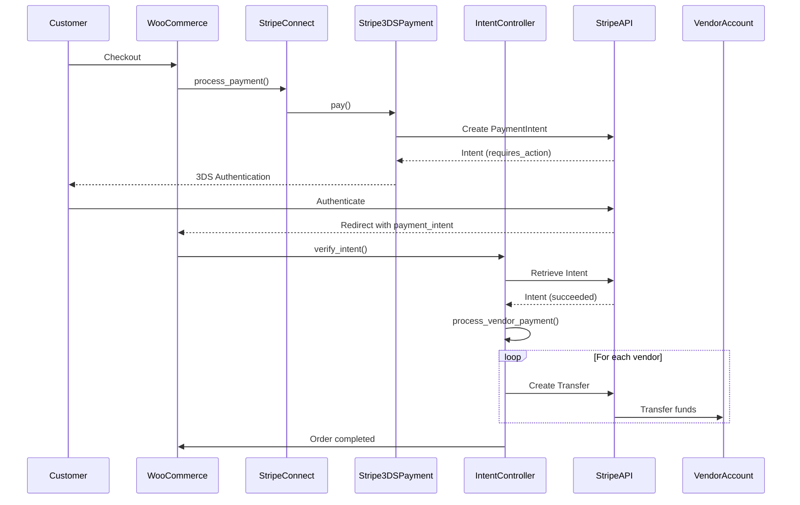
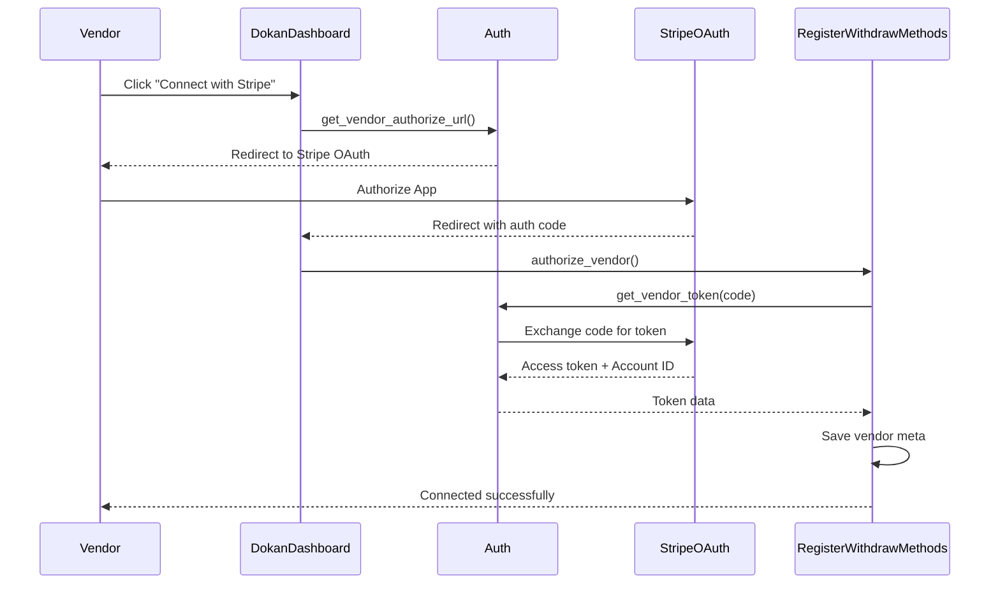

# Dokan Stripe Connect Module - Developer Documentation

This document provides a comprehensive developer guide to understanding how Dokan implements Stripe Connect for multi-vendor marketplace payments.

## Table of Contents

1. [Overview](#1-overview)
2. [Module Architecture](#2-module-architecture)
3. [File Structure](#3-file-structure)
4. [Core Classes](#4-core-classes)
5. [Payment Flow](#5-payment-flow)
6. [Stripe Connect Integration](#6-stripe-connect-integration)
7. [Split Payment Logic](#7-split-payment-logic)
8. [Webhook Handling](#8-webhook-handling)
9. [Refund Processing](#9-refund-processing)
10. [Subscription Handling](#10-subscription-handling)
11. [Database Schema](#11-database-schema)
12. [Hooks and Filters](#12-hooks-and-filters)
13. [Extension Examples](#13-extension-examples)
14. [Best Practices](#14-best-practices)

---

## 1. Overview

The Dokan Stripe Connect module enables multi-vendor marketplaces to process payments through Stripe, automatically splitting payments between the marketplace (admin) and vendors. It uses **Stripe Connect** with the **destination charges** pattern for payment splitting.

### Key Features

-   **Stripe Connect OAuth**: Vendors connect their Stripe accounts via OAuth
-   **3D Secure / SCA Support**: Strong Customer Authentication compliance
-   **Split Payments**: Automatic payment splitting between admin and vendors
-   **Saved Cards**: Customers can save payment methods
-   **Subscription Support**: WooCommerce Subscriptions integration
-   **Webhook Processing**: Real-time event handling
-   **Automatic Refunds**: Proportional refund processing

### How It Works (High Level)

```
Customer Checkout
       ↓
Payment captured on Admin's Stripe account
       ↓
Commission calculated (based on Dokan commission settings)
       ↓
Transfer sent to Vendor's connected Stripe account
       ↓
Withdraw entry created in Dokan
       ↓
Vendor receives payout via Stripe
```

---

## 2. Module Architecture

### Design Patterns Used

1. **Factory Pattern**: `DokanStripe` provides factory methods for creating instances
2. **Strategy Pattern**: Different payment methods (3DS vs Non-3DS)
3. **Chain of Responsibility**: Webhook event handling
4. **Dependency Injection**: Controllers registered via container

### Class Relationships

```
┌─────────────────────────────────────────────────────────────────────────┐
│                           Module Bootstrap                               │
├─────────────────────────────────────────────────────────────────────────┤
│  Module (module.php)                                                     │
│       ├── RegisterGateways      (WooCommerce gateway registration)       │
│       ├── WebhookHandler        (Stripe webhook processing)              │
│       ├── RegisterWithdrawMethods (Vendor withdraw methods)              │
│       ├── IntentController      (Payment intent handling)                │
│       ├── ProductSubscription   (Vendor subscription handling)           │
│       ├── PaymentTokens         (Saved payment methods)                  │
│       ├── Refund                (Refund processing)                      │
│       ├── Validation            (Input validation)                       │
│       ├── StoreProgress         (Store setup tracking)                   │
│       └── VendorProfile         (Vendor profile integration)             │
└─────────────────────────────────────────────────────────────────────────┘

┌─────────────────────────────────────────────────────────────────────────┐
│                         Payment Gateway                                  │
├─────────────────────────────────────────────────────────────────────────┤
│  WC_Payment_Gateway_CC                                                   │
│       └── StripePaymentGateway (Abstract)                               │
│               └── StripeConnect (Main Gateway Class)                     │
└─────────────────────────────────────────────────────────────────────────┘

┌─────────────────────────────────────────────────────────────────────────┐
│                        Payment Methods                                   │
├─────────────────────────────────────────────────────────────────────────┤
│  Payable (Interface)                                                     │
│       ├── Stripe3DSPayment      (Payment Intents API)                   │
│       └── StripeNon3DSPayment   (Charges API - Legacy)                  │
└─────────────────────────────────────────────────────────────────────────┘

┌─────────────────────────────────────────────────────────────────────────┐
│                        Webhook Events                                    │
├─────────────────────────────────────────────────────────────────────────┤
│  WebhookHandleable (Interface)                                          │
│       ├── ChargeDisputeCreated                                          │
│       ├── ChargeDisputeClosed                                           │
│       ├── InvoicePaymentSucceeded                                       │
│       ├── InvoicePaymentFailed                                          │
│       ├── InvoicePaymentActionRequired                                  │
│       ├── SubscriptionUpdated                                           │
│       ├── SubscriptionDeleted                                           │
│       └── SubscriptionTrialWillEnd                                      │
└─────────────────────────────────────────────────────────────────────────┘
```

---

## 3. File Structure

```
modules/stripe/
├── module.php                          # Main module bootstrap
├── composer.json                       # Composer dependencies
├── assets/
│   ├── css/
│   │   └── stripe.css                 # Frontend styles
│   ├── js/
│   │   ├── stripe.js                  # Non-3DS payment scripts
│   │   └── stripe-3ds.js              # 3DS/SCA payment scripts
│   └── images/
│       ├── cards.png                  # Card icons
│       ├── eu_cards.png               # EU card icons
│       └── stripe-withdraw-method.svg # Withdraw method icon
├── includes/
│   ├── Abstracts/
│   │   └── StripePaymentGateway.php  # Base gateway class
│   ├── Factories/
│   │   ├── EventFactory.php          # Webhook event factory
│   │   └── StripeFactory.php         # Payment method factory
│   ├── Gateways/
│   │   └── RegisterGateways.php      # Gateway registration
│   ├── Interfaces/
│   │   ├── Payable.php               # Payment method interface
│   │   └── WebhookHandleable.php     # Webhook handler interface
│   ├── PaymentMethods/
│   │   ├── Stripe3DSPayment.php      # 3DS payment handler
│   │   └── StripeNon3DSPayment.php   # Non-3DS payment handler
│   ├── Settings/
│   │   ├── RetrieveSettings.php      # Settings retrieval
│   │   └── StripeConnect.php         # Gateway settings array
│   ├── Subscriptions/
│   │   ├── InvoiceEmail.php          # Subscription invoice emails
│   │   └── ProductSubscription.php   # Vendor subscription handling
│   ├── WebhooksEvents/
│   │   ├── ChargeDisputeClosed.php
│   │   ├── ChargeDisputeCreated.php
│   │   ├── InvoicePaymentActionRequired.php
│   │   ├── InvoicePaymentFailed.php
│   │   ├── InvoicePaymentSucceeded.php
│   │   ├── SubscriptionDeleted.php
│   │   ├── SubscriptionTrialWillEnd.php
│   │   └── SubscriptionUpdated.php
│   ├── WithdrawMethods/
│   │   └── RegisterWithdrawMethods.php
│   ├── Auth.php                      # OAuth authorization
│   ├── Customer.php                  # Stripe customer management
│   ├── DokanStripe.php               # Static factory class
│   ├── Helper.php                    # Utility functions
│   ├── IntentController.php          # Payment intent handling
│   ├── PaymentTokens.php             # Saved payment methods
│   ├── Refund.php                    # Refund processing
│   ├── StripeConnect.php             # Main gateway class
│   ├── StoreProgress.php             # Store setup progress
│   ├── Transaction.php               # Transfer/transaction handling
│   ├── Validation.php                # Input validation
│   ├── VendorProfile.php             # Vendor profile integration
│   └── WebhookHandler.php            # Webhook endpoint handler
└── templates/
    ├── admin-options.php             # Admin settings template
    ├── vendor-settings-payment.php   # Vendor connection UI
    └── emails/
        ├── invoice.php               # HTML invoice email
        └── plain/
            └── invoice.php           # Plain text invoice email
```

---

## 4. Core Classes

### Module Bootstrap (`Module`)

```php
namespace WeDevs\DokanPro\Modules\Stripe;

class Module {
    use ChainableContainer;

    public function __construct() {
        $this->define_constants();
        $this->set_controllers();

        // Activation/Deactivation hooks
        add_action( 'dokan_activated_module_stripe', [ self::class, 'activate' ] );
        add_action( 'dokan_deactivated_module_stripe', [ self::class, 'deactivate' ] );

        // Vendor access key validation
        add_action( 'dokan_dashboard_before_widgets', [ $this, 'check_vendor_access_key_is_valid' ] );
    }

    private function set_controllers() {
        $this->container['register_gateways'] = new RegisterGateways();
        $this->container['webhook'] = new WebhookHandler();

        if ( ! Helper::is_enabled() ) {
            return;
        }

        $this->container['register_withdraw_methods'] = new RegisterWithdrawMethods();
        $this->container['intent_controller'] = new IntentController();
        $this->container['product_subscription'] = new ProductSubscription();
        // ... more controllers
    }
}
```

### Main Gateway Class (`StripeConnect`)

```php
namespace WeDevs\DokanPro\Modules\Stripe;

class StripeConnect extends StripePaymentGateway {
    public function __construct() {
        $this->id = 'dokan-stripe-connect';
        $this->method_title = __( 'Dokan Stripe Connect', 'dokan' );

        $this->supports = [
            'products',
            'refunds',
            'tokenization',
            'subscriptions',
            'subscription_cancellation',
            'subscription_suspension',
            'subscription_reactivation',
            'subscription_amount_changes',
            'subscription_date_changes',
            'subscription_payment_method_change',
            'subscription_payment_method_change_customer',
            'subscription_payment_method_change_admin',
        ];

        Helper::bootstrap_stripe();
        $this->hooks();
    }

    public function process_payment( $order_id ) {
        $order = wc_get_order( $order_id );
        return DokanStripe::process( $order )->pay();
    }
}
```

### DokanStripe Factory (`DokanStripe`)

```php
namespace WeDevs\DokanPro\Modules\Stripe;

class DokanStripe {
    /**
     * Get event factory for webhook handling
     */
    public static function events(): EventFactory {
        return new EventFactory();
    }

    /**
     * Get transaction builder for transfers
     */
    public static function transfer(): Transaction {
        return new Transaction();
    }

    /**
     * Get payment processor for order
     */
    public static function process( $order ): StripeFactory {
        return new StripeFactory( $order );
    }
}
```

### Helper Class (`Helper`)

```php
namespace WeDevs\DokanPro\Modules\Stripe;

class Helper {
    /**
     * Initialize Stripe SDK
     */
    public static function bootstrap_stripe() {
        if ( ! self::is_ready() ) {
            return;
        }

        self::set_app_info();
        self::set_api_version();

        if ( self::is_test_mode() ) {
            \Stripe\Stripe::setVerifySslCerts( false );
        }

        \Stripe\Stripe::setClientId( self::get_client_id() );
        \Stripe\Stripe::setApiKey( self::get_secret_key() );
    }

    /**
     * Convert amount to Stripe format (cents)
     */
    public static function get_stripe_amount( $amount, $currency = '' ) {
        if ( empty( $currency ) ) {
            $currency = get_woocommerce_currency();
        }

        // Zero-decimal currencies don't need multiplication
        if ( in_array( strtolower( $currency ), self::get_zero_decimal_currencies() ) ) {
            return absint( $amount );
        }

        return absint( wc_format_decimal( ( (float) $amount * 100 ), wc_get_price_decimals() ) );
    }

    /**
     * Get gateway settings
     */
    public static function get_settings() {
        return RetrieveSettings::instance()->get_settings();
    }

    /**
     * Check if 3D Secure is enabled
     */
    public static function is_3d_secure_enabled() {
        return 'yes' === self::get_settings()['enable_3d_secure'];
    }

    /**
     * Get connected vendor ID
     */
    public static function get_connected_vendor_id( $seller_id ) {
        return get_user_meta( $seller_id, 'dokan_connected_vendor_id', true );
    }
}
```

---

## 5. Payment Flow

### 3D Secure Payment Flow (Recommended)



### Code Flow: 3DS Payment

**Step 1: Payment Initiation**

```php
// StripeConnect::process_payment()
public function process_payment( $order_id ) {
    $order = wc_get_order( $order_id );

    // Factory determines which payment method to use
    return DokanStripe::process( $order )->pay();
}
```

**Step 2: StripeFactory Selection**

```php
// StripeFactory::pay()
public function pay() {
    // Get appropriate payment method (3DS or Non-3DS)
    $payment_method = $this->get_payment_method();
    return $payment_method->pay();
}

protected function get_payment_method() {
    if ( Helper::is_3d_secure_enabled() ) {
        return new Stripe3DSPayment( $this->order );
    }
    return new StripeNon3DSPayment( $this->order );
}
```

**Step 3: Create Payment Intent**

```php
// Stripe3DSPayment::pay()
public function pay() {
    // Prepare payment source (card token)
    $prepared_source = $this->prepare_source( $this->order );

    // Get or create PaymentIntent
    $intent = $this->get_intent_from_order( $this->order );

    if ( $intent ) {
        $intent = $this->update_existing_intent( $intent, $this->order, $prepared_source );
    } else {
        $intent = $this->create_intent( $this->order, $prepared_source );
    }

    // Check intent status
    if ( 'requires_confirmation' === $intent->status ) {
        $intent->confirm();
    }

    // Return appropriate response based on status
    return $this->handle_intent_status( $intent, $this->order );
}
```

**Step 4: Handle Authentication**

```php
// Stripe3DSPayment::create_intent()
public function create_intent( $order, $prepared_source, $amount = null ) {
    $payment_info = $this->generate_payment_info( $order );

    $request = [
        'source'               => $prepared_source->source,
        'amount'               => Helper::get_stripe_amount( $order->get_total() ),
        'currency'             => strtolower( $order->get_currency() ),
        'description'          => $payment_info['description'],
        'metadata'             => $payment_info['metadata'],
        'capture_method'       => 'automatic',
        'payment_method_types' => [ 'card' ],
    ];

    // Add transfer group for multi-vendor orders
    if ( ! empty( $payment_info['transfer_group'] ) ) {
        $request['transfer_group'] = $payment_info['transfer_group'];
    }

    $intent = \Stripe\PaymentIntent::create( $request );
    $this->save_intent_to_order( $order, $intent );

    return $intent;
}
```

**Step 5: Verify Intent & Process Transfers**

```php
// IntentController::verify_intent()
public function verify_intent( $order ) {
    $intent = $this->get_intent_from_order( $order );

    if ( 'succeeded' === $intent->status ) {
        WC()->cart->empty_cart();
        $this->handle_intent_verification_success( $order, $intent );

        // Process vendor payments
        $this->process_vendor_payment( $order, $intent );

        do_action( 'dokan_stripe_payment_completed', $order, $intent );
    }
}

// IntentController::process_vendor_payment()
public function process_vendor_payment( $order, $intent ) {
    $all_orders = Helper::get_all_orders_to_be_processed( $order );
    $charge_id = $intent->charges->data[0]->id;

    foreach ( $all_orders as $tmp_order ) {
        $vendor_id = dokan_get_seller_id_by_order( $tmp_order->get_id() );
        $connected_vendor_id = Helper::get_connected_vendor_id( $vendor_id );

        if ( empty( $connected_vendor_id ) ) {
            continue; // Skip non-connected vendors
        }

        // Calculate vendor earning
        $vendor_earning = $this->calculate_vendor_earning( $tmp_order );

        // Create transfer to vendor
        $transfer = DokanStripe::transfer()
            ->amount( $vendor_earning, $order->get_currency() )
            ->from( $charge_id )
            ->to( $connected_vendor_id )
            ->description( "Payment for Order #{$tmp_order->get_id()}" )
            ->group( "order_{$order->get_id()}" )
            ->send();

        // Save transfer ID
        $tmp_order->update_meta_data( '_dokan_stripe_transfer_id', $transfer->id );
        $tmp_order->save();

        // Create withdraw entry
        $this->create_withdraw_entry( $tmp_order, $vendor_id, $vendor_earning );
    }
}
```

---

## 6. Stripe Connect Integration

### Vendor Onboarding Flow



### OAuth Implementation

**Generate Authorization URL**

```php
// Auth.php
class Auth extends \Stripe\OAuth {

    public static function get_vendor_authorize_url() {
        return self::authorizeUrl( [
            'scope'        => 'read_write',
            'redirect_uri' => dokan_get_navigation_url( 'settings/payment-manage-dokan-stripe-connect' ),
            'state'        => 'dokan-stripe-connect:' . wp_create_nonce( 'dokan-stripe-vendor-authorize' ),
        ] );
    }

    public static function get_vendor_token( $code ) {
        return self::token( [
            'code'       => $code,
            'grant_type' => 'authorization_code',
        ] );
    }

    public static function deauthorize() {
        $access_token = get_user_meta( get_current_user_id(), '_stripe_connect_access_key', true );

        return self::deauthorize( [
            'stripe_user_id' => get_user_meta( get_current_user_id(), 'dokan_connected_vendor_id', true ),
        ] );
    }
}
```

**Handle Authorization Callback**

```php
// RegisterWithdrawMethods.php
public function authorize_vendor() {
    // Verify nonce from state parameter
    $state = isset( $_GET['state'] ) ? sanitize_text_field( $_GET['state'] ) : '';

    if ( strpos( $state, 'dokan-stripe-connect:' ) !== 0 ) {
        return;
    }

    $nonce = str_replace( 'dokan-stripe-connect:', '', $state );

    if ( ! wp_verify_nonce( $nonce, 'dokan-stripe-vendor-authorize' ) ) {
        wc_add_notice( __( 'Invalid authorization request.', 'dokan' ), 'error' );
        return;
    }

    // Exchange code for token
    $code = isset( $_GET['code'] ) ? sanitize_text_field( $_GET['code'] ) : '';

    try {
        $response = Auth::get_vendor_token( $code );

        // Save vendor credentials
        $user_id = get_current_user_id();
        update_user_meta( $user_id, 'dokan_connected_vendor_id', $response->stripe_user_id );
        update_user_meta( $user_id, '_stripe_connect_access_key', $response->access_token );

        // Update profile completion
        dokan_pro()->store_settings->update_profile_completion( $user_id, 'payment' );

        wc_add_notice( __( 'Your Stripe account has been connected successfully.', 'dokan' ), 'success' );

    } catch ( Exception $e ) {
        wc_add_notice( $e->getMessage(), 'error' );
    }
}
```

**Disconnect Vendor**

```php
// RegisterWithdrawMethods.php
public function deauthorize_vendor() {
    if ( ! wp_verify_nonce( $_POST['_wpnonce'], 'dokan-stripe-vendor-deauthorize' ) ) {
        wp_send_json_error( __( 'Invalid request.', 'dokan' ) );
    }

    try {
        Auth::deauthorize();

        $user_id = get_current_user_id();
        delete_user_meta( $user_id, 'dokan_connected_vendor_id' );
        delete_user_meta( $user_id, '_stripe_connect_access_key' );

        wp_send_json_success( __( 'Your Stripe account has been disconnected.', 'dokan' ) );

    } catch ( Exception $e ) {
        wp_send_json_error( $e->getMessage() );
    }
}
```

---

## 7. Split Payment Logic

### Transaction Class

The `Transaction` class provides a fluent interface for creating Stripe Transfers:

```php
// Transaction.php
class Transaction {
    protected $amount;
    protected $currency;
    protected $destination;
    protected $description;
    protected $metadata = [];
    protected $transfer_group;
    protected $source_transaction;

    /**
     * Set transfer amount
     */
    public function amount( $amount, $currency = '' ): self {
        $this->amount = Helper::get_stripe_amount( $amount, $currency );
        $this->currency = $currency ?: get_woocommerce_currency();
        return $this;
    }

    /**
     * Set source charge/payment
     */
    public function from( $charge_id ): self {
        $this->source_transaction = $charge_id;
        return $this;
    }

    /**
     * Set destination (vendor's Stripe account)
     */
    public function to( $connected_account_id ): self {
        $this->destination = $connected_account_id;
        return $this;
    }

    /**
     * Set transfer group (links related transfers)
     */
    public function group( $group ): self {
        $this->transfer_group = $group;
        return $this;
    }

    /**
     * Execute the transfer
     */
    public function send() {
        $params = [
            'amount'      => $this->amount,
            'currency'    => strtolower( $this->currency ),
            'destination' => $this->destination,
        ];

        if ( ! empty( $this->description ) ) {
            $params['description'] = $this->description;
        }

        if ( ! empty( $this->metadata ) ) {
            $params['metadata'] = $this->metadata;
        }

        if ( ! empty( $this->transfer_group ) ) {
            $params['transfer_group'] = $this->transfer_group;
        }

        if ( ! empty( $this->source_transaction ) ) {
            $params['source_transaction'] = $this->source_transaction;
        }

        try {
            return \Stripe\Transfer::create( $params );
        } catch ( Exception $e ) {
            dokan_log( '[Stripe Connect] Transfer Error: ' . $e->getMessage() );
            throw new DokanException( 'dokan_unable_to_transfer', $e->getMessage() );
        }
    }
}
```

### Vendor Earning Calculation

```php
// IntentController.php
protected function calculate_vendor_earning( $order ) {
    // Get order total
    $order_total = $order->get_total();

    // Get admin commission using Dokan's commission system
    $admin_commission = dokan()->commission->get_earning_by_order( $order, 'admin' );

    // Vendor earning = Order Total - Admin Commission
    $vendor_earning = $order_total - $admin_commission;

    // Handle gateway fees if vendor pays
    if ( Helper::seller_pays_the_gateway_fee() ) {
        $gateway_fee = $this->get_gateway_fee( $order );
        $vendor_earning -= $gateway_fee;

        // Store gateway fee for records
        $order->update_meta_data( 'dokan_gateway_stripe_fee', $gateway_fee );
        $order->update_meta_data( 'dokan_gateway_fee_paid_by', 'seller' );
    }

    return max( 0, $vendor_earning );
}

protected function get_gateway_fee( $order ) {
    // Retrieve balance transaction from Stripe for actual fee
    $intent_id = $order->get_meta( 'dokan_stripe_intent_id' );
    $intent = \Stripe\PaymentIntent::retrieve( $intent_id );

    $charge_id = $intent->charges->data[0]->id;
    $charge = \Stripe\Charge::retrieve( $charge_id );

    $balance_transaction = \Stripe\BalanceTransaction::retrieve(
        $charge->balance_transaction
    );

    // Convert from cents to dollars
    return $balance_transaction->fee / 100;
}
```

### Withdraw Entry Creation

```php
// IntentController.php
protected function create_withdraw_entry( $order, $vendor_id, $amount ) {
    global $wpdb;

    $wpdb->insert(
        $wpdb->prefix . 'dokan_vendor_balance',
        [
            'vendor_id'    => $vendor_id,
            'trn_id'       => $order->get_id(),
            'trn_type'     => 'dokan_orders',
            'perticulars'  => sprintf( 'Order %s payment via Stripe', $order->get_id() ),
            'debit'        => $amount,
            'credit'       => 0,
            'status'       => 'approved',
            'trn_date'     => current_time( 'mysql' ),
            'balance_date' => current_time( 'mysql' ),
        ],
        [ '%d', '%d', '%s', '%s', '%f', '%f', '%s', '%s', '%s' ]
    );
}
```

---

## 8. Webhook Handling

### Webhook Registration

```php
// WebhookHandler.php
class WebhookHandler {

    public function __construct() {
        add_action( 'woocommerce_api_dokan_stripe', [ $this, 'handle_events' ] );
    }

    public function register_webhook() {
        try {
            $this->deregister_webhook();

            $response = \Stripe\WebhookEndpoint::create( [
                'api_version'    => '2020-08-27',
                'url'            => home_url( 'wc-api/dokan_stripe' ),
                'enabled_events' => $this->get_events(),
                'description'    => __( 'This webhook is created by Dokan Pro.', 'dokan' ),
            ] );

            // Store webhook ID for later deletion
            update_option( 'dokan_stripe_webhook_id', $response->id );

        } catch ( Exception $e ) {
            dokan_log( 'Could not create webhook: ' . $e->getMessage() );
        }
    }

    public function get_events() {
        return apply_filters( 'dokan_get_webhook_events', [
            'charge.dispute.closed',
            'charge.dispute.created',
            'customer.subscription.deleted',
            'customer.subscription.trial_will_end',
            'customer.subscription.updated',
            'invoice.payment_action_required',
            'invoice.payment_failed',
            'invoice.payment_succeeded',
        ] );
    }
}
```

### Event Processing

```php
// WebhookHandler.php
public function handle_events() {
    $request_body = file_get_contents( 'php://input' );
    $event = json_decode( $request_body );

    if ( empty( $event->id ) ) {
        status_header( 400 );
        exit;
    }

    try {
        // For vendor-specific events, use vendor's API key
        if ( ! empty( $event->account ) ) {
            $this->switch_to_vendor_api_key( $event->account );
        }

        // Retrieve event from Stripe to verify authenticity
        $event = \Stripe\Event::retrieve( $event->id );

        // Check if this event type is supported
        $supported_events = Helper::get_supported_webhook_events();

        if ( array_key_exists( $event->type, $supported_events ) ) {
            // Get handler using factory
            $handler = DokanStripe::events()->get( $event );
            $handler->handle();
        }

        status_header( 200 );
        exit;

    } catch ( Exception $e ) {
        dokan_log( 'Webhook Processing Error: ' . $e->getMessage(), 'error' );
        status_header( 500 );
        exit;
    }
}

protected function switch_to_vendor_api_key( $account_id ) {
    $users = get_users( [
        'meta_key'     => 'dokan_connected_vendor_id',
        'meta_value'   => $account_id,
        'meta_compare' => '=',
    ] );

    if ( ! empty( $users ) ) {
        $vendor_id = $users[0]->ID;
        $access_key = get_user_meta( $vendor_id, '_stripe_connect_access_key', true );
        \Stripe\Stripe::setApiKey( $access_key );
    }
}
```

### Event Factory

```php
// Factories/EventFactory.php
class EventFactory {

    protected $events = [
        'charge.dispute.closed'               => ChargeDisputeClosed::class,
        'charge.dispute.created'              => ChargeDisputeCreated::class,
        'invoice.payment_succeeded'           => InvoicePaymentSucceeded::class,
        'invoice.payment_failed'              => InvoicePaymentFailed::class,
        'invoice.payment_action_required'     => InvoicePaymentActionRequired::class,
        'customer.subscription.updated'       => SubscriptionUpdated::class,
        'customer.subscription.deleted'       => SubscriptionDeleted::class,
        'customer.subscription.trial_will_end'=> SubscriptionTrialWillEnd::class,
    ];

    public function get( $event ): WebhookHandleable {
        $handler_class = $this->events[ $event->type ] ?? null;

        if ( ! $handler_class ) {
            throw new Exception( "No handler for event type: {$event->type}" );
        }

        return new $handler_class( $event );
    }
}
```

### Example Event Handler

```php
// WebhooksEvents/InvoicePaymentSucceeded.php
class InvoicePaymentSucceeded implements WebhookHandleable {

    protected $event;

    public function __construct( $event ) {
        $this->event = $event;
    }

    public function handle() {
        $invoice = $this->event->data->object;

        // Find subscription
        $subscription_id = $invoice->subscription;

        // Find WooCommerce order by subscription
        $orders = wc_get_orders( [
            'meta_key'   => '_stripe_subscription_id',
            'meta_value' => $subscription_id,
            'limit'      => 1,
        ] );

        if ( empty( $orders ) ) {
            return;
        }

        $order = $orders[0];

        // Create renewal order if this is a recurring payment
        if ( $invoice->billing_reason === 'subscription_cycle' ) {
            $renewal_order = $this->create_renewal_order( $order, $invoice );
            $renewal_order->payment_complete( $invoice->charge );
        }
    }
}
```

---

## 9. Refund Processing

### Refund Class

```php
// Refund.php
class Refund {

    public function __construct() {
        add_action( 'dokan_refund_request_created', [ $this, 'process_refund' ], 10, 4 );
    }

    public function process_refund( $refund, $order, $vendor_refund, $tax_refund ) {
        if ( Helper::is_3d_secure_enabled() ) {
            $this->process_3ds_refund( $refund, $order, $vendor_refund, $tax_refund );
        } else {
            $this->process_non_3ds_refund( $refund, $order, $vendor_refund, $tax_refund );
        }
    }
}
```

### 3DS Refund Flow

```php
// Refund.php
protected function process_3ds_refund( $refund, $order, $vendor_refund, $tax_refund ) {
    // Get payment intent
    $intent_id = $order->get_meta( 'dokan_stripe_intent_id' );
    $intent = \Stripe\PaymentIntent::retrieve( $intent_id );

    $charge_id = $intent->charges->data[0]->id;
    $transfer_id = $order->get_meta( '_dokan_stripe_transfer_id' );

    // Calculate refund amounts
    $total_refund = $vendor_refund + $tax_refund;

    // 1. Create refund on admin account
    $stripe_refund = \Stripe\Refund::create( [
        'charge' => $charge_id,
        'amount' => Helper::get_stripe_amount( $total_refund ),
    ] );

    // 2. Reverse transfer from vendor
    if ( $transfer_id && $vendor_refund > 0 ) {
        $transfer_reversal = \Stripe\Transfer::createReversal(
            $transfer_id,
            [ 'amount' => Helper::get_stripe_amount( $vendor_refund ) ]
        );
    }

    // 3. Update vendor balance
    $vendor_id = dokan_get_seller_id_by_order( $order->get_id() );
    $this->debit_vendor_balance( $vendor_id, $order->get_id(), $vendor_refund );

    // 4. Approve refund request
    $this->approve_refund( $refund, $stripe_refund );
}
```

### Non-3DS Refund Flow

```php
// Refund.php
protected function process_non_3ds_refund( $refund, $order, $vendor_refund, $tax_refund ) {
    $vendor_id = dokan_get_seller_id_by_order( $order->get_id() );
    $charge_id = $order->get_meta( "_dokan_stripe_charge_id_{$vendor_id}" );

    // Get vendor's access token
    $access_token = get_user_meta( $vendor_id, '_stripe_connect_access_key', true );

    // Create refund on vendor's Stripe account
    \Stripe\Stripe::setApiKey( $access_token );

    $stripe_refund = \Stripe\Refund::create( [
        'charge'                    => $charge_id,
        'amount'                    => Helper::get_stripe_amount( $vendor_refund ),
        'refund_application_fee'    => true, // Also refund admin's commission
    ] );

    // Reset to admin API key
    Helper::bootstrap_stripe();

    // Update vendor balance
    $this->debit_vendor_balance( $vendor_id, $order->get_id(), $vendor_refund );

    // Approve refund
    $this->approve_refund( $refund, $stripe_refund );
}

protected function debit_vendor_balance( $vendor_id, $order_id, $amount ) {
    global $wpdb;

    $wpdb->insert(
        $wpdb->prefix . 'dokan_vendor_balance',
        [
            'vendor_id'    => $vendor_id,
            'trn_id'       => $order_id,
            'trn_type'     => 'dokan_refund',
            'perticulars'  => sprintf( 'Refund for Order %s', $order_id ),
            'debit'        => 0,
            'credit'       => $amount,
            'status'       => 'approved',
            'trn_date'     => current_time( 'mysql' ),
            'balance_date' => current_time( 'mysql' ),
        ]
    );
}
```

---

## 10. Subscription Handling

### WooCommerce Subscriptions Integration

```php
// StripeConnect.php
public function scheduled_subscription_payment( $amount, $renewal_order ) {
    try {
        // Get parent order's payment info
        $subscription = wcs_get_subscriptions_for_renewal_order( $renewal_order, true );
        $subscription = reset( $subscription );

        // Get saved payment method
        $source_id = $subscription->get_meta( '_stripe_source_id' );
        $customer_id = $subscription->get_meta( '_stripe_customer_id' );

        // Create payment intent for renewal
        $intent = \Stripe\PaymentIntent::create( [
            'amount'               => Helper::get_stripe_amount( $amount ),
            'currency'             => strtolower( $renewal_order->get_currency() ),
            'customer'             => $customer_id,
            'payment_method'       => $source_id,
            'off_session'          => true,
            'confirm'              => true,
            'description'          => "Renewal for Subscription #{$subscription->get_id()}",
        ] );

        if ( 'succeeded' === $intent->status ) {
            $renewal_order->payment_complete( $intent->charges->data[0]->id );

            // Process vendor transfers
            $this->handle_transfer_payment( $renewal_order );
        }

    } catch ( \Stripe\Exception\CardException $e ) {
        // Card declined - subscription will be marked as failed
        $renewal_order->update_status( 'failed', $e->getMessage() );
    }
}
```

### Vendor Subscription Products

```php
// Subscriptions/ProductSubscription.php
class ProductSubscription {

    public function __construct() {
        add_action( 'dokan_process_subscription_order', [ $this, 'process_subscription' ], 10, 2 );
        add_action( 'dps_cancel_recurring_subscription', [ $this, 'cancel_subscription' ] );
    }

    public function process_subscription( $order, $vendor_id ) {
        $product = $this->get_subscription_product( $order );

        if ( ! $product ) {
            return;
        }

        // Check if recurring subscription
        if ( $product->get_meta( '_dokan_subscription_type' ) === 'recurring' ) {
            $this->create_stripe_subscription( $order, $vendor_id, $product );
        } else {
            // One-time subscription - just activate
            $this->activate_vendor_subscription( $vendor_id, $product );
        }
    }

    protected function create_stripe_subscription( $order, $vendor_id, $product ) {
        $customer_id = $this->get_or_create_customer( $vendor_id );
        $price_id = $this->get_or_create_price( $product );

        $subscription = \Stripe\Subscription::create( [
            'customer' => $customer_id,
            'items'    => [
                [ 'price' => $price_id ],
            ],
            'metadata' => [
                'vendor_id'  => $vendor_id,
                'order_id'   => $order->get_id(),
                'product_id' => $product->get_id(),
            ],
        ] );

        // Save subscription ID
        update_user_meta( $vendor_id, '_stripe_subscription_id', $subscription->id );
        update_user_meta( $vendor_id, 'product_package_id', $product->get_id() );
        update_user_meta( $vendor_id, 'product_order_id', $order->get_id() );

        // Activate subscription
        $this->activate_vendor_subscription( $vendor_id, $product );
    }

    public function cancel_subscription( $vendor_id ) {
        $subscription_id = get_user_meta( $vendor_id, '_stripe_subscription_id', true );

        if ( $subscription_id ) {
            try {
                $subscription = \Stripe\Subscription::retrieve( $subscription_id );
                $subscription->cancel();

                delete_user_meta( $vendor_id, '_stripe_subscription_id' );

            } catch ( Exception $e ) {
                dokan_log( 'Failed to cancel Stripe subscription: ' . $e->getMessage() );
            }
        }
    }
}
```

---

## 11. Database Schema

### Order Meta Keys

| Meta Key                               | Description               | Used In                  |
| -------------------------------------- | ------------------------- | ------------------------ |
| `dokan_stripe_intent_id`               | PaymentIntent ID          | 3DS payments             |
| `_stripe_intent_id`                    | PaymentIntent ID (legacy) | Older orders             |
| `_stripe_customer_id`                  | Stripe Customer ID        | All payments             |
| `_stripe_source_id`                    | Payment source/method ID  | Saved cards              |
| `_transaction_id`                      | Charge ID                 | WooCommerce standard     |
| `_dokan_stripe_charge_id_{$vendor_id}` | Vendor charge ID          | Non-3DS mode             |
| `_dokan_stripe_transfer_id`            | Transfer ID               | 3DS mode                 |
| `paid_with_dokan_3ds`                  | Boolean flag              | Payment method indicator |
| `dokan_gateway_stripe_fee`             | Gateway fee amount        | Fee tracking             |
| `dokan_gateway_fee_paid_by`            | Fee payer (seller/admin)  | Fee assignment           |

### User Meta Keys

| Meta Key                     | Description                    | Used For             |
| ---------------------------- | ------------------------------ | -------------------- |
| `dokan_connected_vendor_id`  | Stripe account ID (`acct_xxx`) | Vendor connection    |
| `_stripe_connect_access_key` | OAuth access token             | API authentication   |
| `dokan_stripe_customer_id`   | Stripe customer ID             | Customer management  |
| `_stripe_subscription_id`    | Vendor subscription ID         | Vendor subscriptions |
| `product_package_id`         | Subscription product ID        | Vendor subscriptions |
| `product_order_id`           | Subscription order ID          | Vendor subscriptions |

### Dokan Tables Used

**`wp_dokan_vendor_balance`**

```sql
+---------------+--------------+------+-----+-------------------+
| Field         | Type         | Null | Key | Default           |
+---------------+--------------+------+-----+-------------------+
| id            | bigint(20)   | NO   | PRI | auto_increment    |
| vendor_id     | bigint(20)   | NO   |     |                   |
| trn_id        | bigint(20)   | NO   |     |                   |
| trn_type      | varchar(30)  | NO   |     |                   |
| perticulars   | text         | NO   |     |                   |
| debit         | decimal(19,4)| NO   |     | 0.0000            |
| credit        | decimal(19,4)| NO   |     | 0.0000            |
| status        | varchar(30)  | YES  |     |                   |
| trn_date      | timestamp    | NO   |     |                   |
| balance_date  | timestamp    | NO   |     |                   |
+---------------+--------------+------+-----+-------------------+
```

---

## 12. Hooks and Filters

### Action Hooks

#### Payment Processing

| Hook                                                           | Parameters           | Description               |
| -------------------------------------------------------------- | -------------------- | ------------------------- |
| `dokan_stripe_payment_completed`                               | `$order, $intent`    | After successful payment  |
| `dokan_gateway_stripe_process_response`                        | `$response, $order`  | After processing response |
| `dokan_gateway_stripe_process_payment_error`                   | `$exception, $order` | On payment error          |
| `dokan_gateway_stripe_process_payment_authentication_required` | `$response, $order`  | SCA required              |

#### Customer Management

| Hook                                    | Parameters              | Description            |
| --------------------------------------- | ----------------------- | ---------------------- |
| `dokan_stripe_connect_add_customer`     | `$customer`             | After customer created |
| `dokan_stripe_connnect_update_customer` | `$customer`             | After customer updated |
| `dokan_stripe_add_source`               | `$source_id, $customer` | After source added     |
| `dokan_stripe_connect_delete_source`    | `$source_id`            | After source deleted   |

#### Subscriptions

| Hook                                  | Parameters           | Description           |
| ------------------------------------- | -------------------- | --------------------- |
| `dokan_process_subscription_order`    | `$order, $vendor_id` | Process subscription  |
| `dps_cancel_recurring_subscription`   | `$vendor_id`         | Cancel subscription   |
| `dps_activate_recurring_subscription` | `$vendor_id`         | Activate subscription |

#### Refunds

| Hook                           | Parameters                                     | Description    |
| ------------------------------ | ---------------------------------------------- | -------------- |
| `dokan_refund_request_created` | `$refund, $order, $vendor_refund, $tax_refund` | Refund created |

### Filter Hooks

#### Settings

| Filter                                      | Parameters  | Description             |
| ------------------------------------------- | ----------- | ----------------------- |
| `dokan_get_stripe_connect_settings`         | `$settings` | Modify gateway settings |
| `dokan_get_webhook_events`                  | `$events`   | Modify webhook events   |
| `dokan_stripe_get_supported_webhook_events` | `$events`   | Supported events        |

#### Payment Processing

| Filter                                 | Parameters               | Description         |
| -------------------------------------- | ------------------------ | ------------------- |
| `dokan_get_all_orders_to_be_processed` | `$orders, $parent_order` | Orders to process   |
| `dokan_stripe_transfer_group`          | `$group, $order`         | Transfer group name |
| `dokan_stripe_payment_metadata`        | `$metadata, $order`      | Payment metadata    |
| `dokan_stripe_generate_payment_info`   | `$info, $order`          | Payment info        |

#### Fees

| Filter                             | Parameters                    | Description            |
| ---------------------------------- | ----------------------------- | ---------------------- |
| `dokan_get_processing_fee`         | `$fee, $order`                | Processing fee         |
| `dokan_get_processing_gateway_fee` | `$fee, $order, $vendor_id`    | Gateway fee per vendor |
| `dokan_orders_vendor_net_amount`   | `$amount, $order, $vendor_id` | Vendor net amount      |

#### UI

| Filter                                              | Parameters     | Description         |
| --------------------------------------------------- | -------------- | ------------------- |
| `dokan_stripe_description`                          | `$description` | Gateway description |
| `dokan_stripe_display_save_payment_method_checkbox` | `$display`     | Show save checkbox  |
| `dokan_stripe_save_to_account_text`                 | `$text`        | Save card text      |

---

## 13. Extension Examples

### Example 1: Custom Transfer Metadata

```php
/**
 * Add custom metadata to Stripe transfers
 */
add_filter( 'dokan_stripe_payment_metadata', function( $metadata, $order ) {
    $metadata['custom_field'] = $order->get_meta( 'my_custom_field' );
    $metadata['store_name'] = dokan()->vendor->get( dokan_get_seller_id_by_order( $order ) )->get_shop_name();

    return $metadata;
}, 10, 2 );
```

### Example 2: Custom Fee Calculation

```php
/**
 * Add marketplace fee to gateway fee
 */
add_filter( 'dokan_get_processing_fee', function( $fee, $order ) {
    // Add fixed marketplace fee
    $marketplace_fee = 0.50; // $0.50 per transaction

    return $fee + $marketplace_fee;
}, 10, 2 );
```

### Example 3: Modify Vendor Net Amount

```php
/**
 * Apply discount to vendor earnings for premium vendors
 */
add_filter( 'dokan_orders_vendor_net_amount', function( $amount, $order, $vendor_id ) {
    // Check if vendor has premium status
    if ( get_user_meta( $vendor_id, 'is_premium_vendor', true ) ) {
        // Premium vendors get 5% bonus
        $amount = $amount * 1.05;
    }

    return $amount;
}, 10, 3 );
```

### Example 4: Custom Webhook Event

```php
/**
 * Add custom webhook event handler
 */
add_filter( 'dokan_get_webhook_events', function( $events ) {
    $events[] = 'payment_intent.payment_failed';
    return $events;
} );

add_filter( 'dokan_stripe_get_supported_webhook_events', function( $events ) {
    $events['payment_intent.payment_failed'] = MyCustomHandler::class;
    return $events;
} );
```

### Example 5: Custom Connect Validation

```php
/**
 * Validate vendor's Stripe account before allowing products
 */
add_action( 'dokan_new_product_added', function( $product_id, $post_data ) {
    $vendor_id = get_current_user_id();
    $connected_id = get_user_meta( $vendor_id, 'dokan_connected_vendor_id', true );

    if ( empty( $connected_id ) ) {
        // Delete the product
        wp_delete_post( $product_id, true );

        // Show error
        wc_add_notice(
            __( 'Please connect your Stripe account before adding products.', 'my-plugin' ),
            'error'
        );
    }
}, 10, 2 );
```

---

## 14. Best Practices

### 1. Always Check Connection Status

```php
// Good
$connected_id = Helper::get_connected_vendor_id( $vendor_id );
if ( empty( $connected_id ) ) {
    // Handle non-connected vendor
}

// Bad - Direct meta access without helper
$connected_id = get_user_meta( $vendor_id, 'dokan_connected_vendor_id', true );
```

### 2. Use Helper Methods for Amount Conversion

```php
// Good - Handles zero-decimal currencies
$amount = Helper::get_stripe_amount( $order->get_total(), $order->get_currency() );

// Bad - Manual conversion
$amount = $order->get_total() * 100;
```

### 3. Handle Exceptions Properly

```php
try {
    $transfer = DokanStripe::transfer()
        ->amount( $amount, $currency )
        ->to( $connected_id )
        ->send();
} catch ( DokanException $e ) {
    // Log and handle gracefully
    dokan_log( 'Transfer failed: ' . $e->getMessage() );
    $order->add_order_note( 'Stripe transfer failed: ' . $e->getMessage() );
}
```

### 4. Use Transaction Groups

```php
// Good - Groups related transfers
DokanStripe::transfer()
    ->group( "order_{$order->get_id()}" )
    ->send();

// This allows easy tracking of all transfers for an order
```

### 5. Always Bootstrap Stripe Before API Calls

```php
// Good
Helper::bootstrap_stripe();
$customer = \Stripe\Customer::create( $args );

// Bad - May use wrong API key
$customer = \Stripe\Customer::create( $args );
```

### 6. Test with Both Modes

Always test your customizations with both 3DS and Non-3DS modes enabled, as the payment flows are significantly different.

### 7. Handle Multi-Vendor Orders

```php
// Good - Process all sub-orders
$all_orders = Helper::get_all_orders_to_be_processed( $parent_order );
foreach ( $all_orders as $order ) {
    // Process each vendor's order
}

// Bad - Only process parent order
$this->process( $parent_order );
```

---

## Summary

The Dokan Stripe Connect module provides a complete solution for marketplace payments:

-   **Stripe Connect OAuth** for vendor onboarding
-   **Payment Intents API** for 3DS/SCA compliance
-   **Automatic transfers** for payment splitting
-   **Webhook handling** for real-time updates
-   **Subscription support** for recurring payments

### Key Integration Points

| Functionality     | Class            | Key Method                   |
| ----------------- | ---------------- | ---------------------------- |
| Process Payment   | `StripeConnect`  | `process_payment()`          |
| Create Transfer   | `Transaction`    | `send()`                     |
| Vendor Connection | `Auth`           | `get_vendor_authorize_url()` |
| Webhook Handling  | `WebhookHandler` | `handle_events()`            |
| Refund Processing | `Refund`         | `process_refund()`           |

---

_Last updated: February 2026_
_Module Version: Dokan Pro 3.x_
